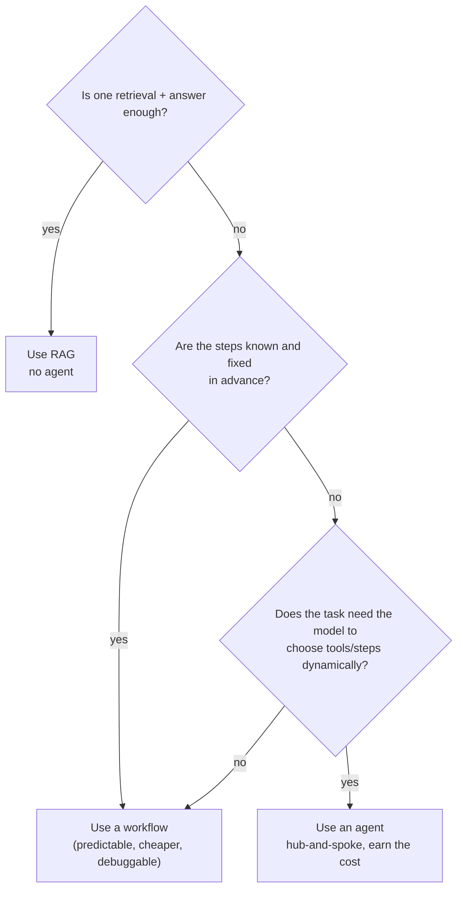

# Decision Frame · Do We Even Need an Agent?

> "Agent" is the word of the moment, so customers ask for one by default. Often
> what they actually need is a single retrieval call or a fixed workflow — at a
> fraction of the cost and failure surface. This frame separates the cases.

::: tip The short version
**Reach for an agent only when the task genuinely needs the model to decide its own
next steps across multiple turns.** If the steps are known in advance, you want a
**workflow**, not an agent. If it's "look something up and answer," you want
**RAG**. Agents cost more and fail in more ways — earn them.
:::

## The three shapes, cheapest first

| Shape | What it is | When it fits | Relative cost |
| --- | --- | --- | --- |
| **Single call / RAG** | One model call, optionally with retrieved context | "Answer this from our docs" | lowest |
| **Workflow** | A fixed sequence of steps you defined | The steps are known and stable | low–medium |
| **Agent** | The model chooses its own steps and tools at runtime | Steps depend on the input and can't be pre-scripted | highest |

## The decision flow

  
What an SE listens for

  
"We want an AI agent" is usually a solution looking for a problem. Ask what the
  task actually is. Nine times out of ten the honest description — "answer
  questions from our handbook," "summarize each ticket the same way" — is RAG or a
  workflow. The tenth genuinely needs dynamic decisioning; that one earns an agent.

## State the numbers (illustrative)

Agentic patterns typically make **3–10× more LLM calls** than a single-shot
approach for the same request — each planning, tool-selection, and reflection step
is more model calls. That's directional, not a constant, but the implication holds:

- **More cost** — you're paying for the extra calls on every request.
- **More latency** — each step is a round-trip; users wait longer.
- **More failure surface** — a flawed planning step can derail the whole run.

::: warning Accuracy note
"3–10×" is a workload-dependent rule of thumb from 2026 sources, not a measured
constant. Use it to convey *order of magnitude* — agents are meaningfully more
expensive and slower — and measure the real multiplier on the actual task before
quoting cost.
:::

## Worked scenario — "we want an agent for customer support"

You unpack the ask:

  

The real task

"Answer customer questions from our help center." → That's RAG. One retrieval, one grounded answer.

  

Where it grows

"…and create a ticket if unresolved, and check order status." → Now it's a workflow with two known tools.

  

Where an agent earns it

"…and handle whatever the customer throws at it, deciding which systems to touch." → Dynamic. Now an agent is justified.

  

The recommendation

Start at RAG, add the two-tool workflow, and only graduate to a full agent when the dynamic case is real — not on day one.

## The failure path

Building an agent for a task that didn't need one: a multi-step orchestrator with
planning and reflection, deployed for what is really a lookup. The result is
slower, costlier, and harder to debug than a single RAG call — and when it
misbehaves, the failure is *inside the model's own decisions*, the hardest kind to
diagnose.

  

Symptom

An "agent" that's slow, expensive, and occasionally takes a baffling action for a simple question.

  

Root cause

Dynamic decisioning added where the steps were actually fixed — complexity with no payoff.

  

Fix

Collapse to a workflow or RAG. Reserve the agent for the part that genuinely needs runtime decisions.

## Audience lens

| | Engineer hears | Exec hears |
| --- | --- | --- |
| RAG / workflow | simpler, debuggable, predictable cost | faster to ship, cheaper to run |
| Agent | dynamic, powerful, harder to test | more capable, but more cost/risk — justify it |

## Talk track

  
Say it like this

  
"Let's make sure we build the right thing. 'Agent' means the AI decides its own
  steps at runtime — powerful, but more expensive, slower, and harder to keep
  reliable. From what you've described, most of this is 'answer from our docs' and
  a couple of fixed actions — which we can do more cheaply and reliably without a
  full agent. I'd reserve the agent for the genuinely open-ended part, if there is
  one. That keeps your cost and your risk down."

  Go deeper
  When you <em>do</em> need one, the orchestration standard and pattern are in
  <a href="/foundations/langgraph-how-to">LangGraph in 10 Minutes</a> and
  <a href="/decisions/001-langgraph-orchestration">ADR 001</a>. You'll build a real
  hub-and-spoke agent in <code>labs/03-agent-system</code> (Phase 2).

