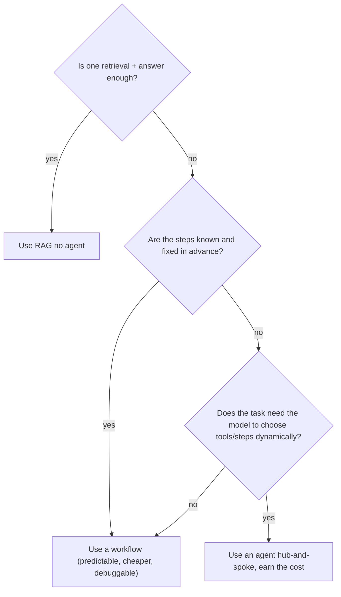

---
tags:
  - decision-frame
  - apps-agents
  - agents
  - customer-facing
---
# Do We Even Need an Agent?

## 📝 Context

"Agent" is the word of the moment, so customers ask for one by default. Often what
they actually need is a single retrieval call or a fixed workflow — at a fraction of
the cost and failure surface. This frame separates the cases.

> **Recommendation:** reach for an agent only when the task genuinely needs the model
> to decide its own next steps across multiple turns. If the steps are known in
> advance, you want a **workflow**. If it's "look something up and answer," you want
> **RAG**. Agents cost more and fail in more ways — earn them.

## 🎯 The Three Shapes, Cheapest First

| Shape | What it is | When it fits | Relative cost |
| --- | --- | --- | --- |
| **Single call / RAG** | One model call, optionally with retrieved context | "Answer this from our docs" | lowest |
| **Workflow** | A fixed sequence of steps you defined | The steps are known and stable | low–medium |
| **Agent** | The model chooses its own steps and tools at runtime | Steps depend on the input and can't be pre-scripted | highest |

## 🧭 Decision Flow

"We want an AI agent" is usually a solution looking for a problem. Ask what the task
actually is. Nine times out of ten the honest description — "answer questions from
our handbook," "summarize each ticket the same way" — is RAG or a workflow. The
tenth genuinely needs dynamic decisioning; that one earns an agent.

## 📊 The Numbers (illustrative)

Agentic patterns typically make **3–10× more LLM calls** than a single-shot approach
for the same request — each planning, tool-selection, and reflection step is more
model calls. Directional, not a constant, but the implication holds:

- **More cost** — you're paying for the extra calls on every request.
- **More latency** — each step is a round-trip; users wait longer.
- **More failure surface** — a flawed planning step can derail the whole run.

> **Accuracy note:** "3–10×" is a workload-dependent rule of thumb from 2026
> sources, not a measured constant. Use it to convey *order of magnitude* — agents
> are meaningfully more expensive and slower — and measure the real multiplier on the
> actual task before quoting cost.

## 🧩 Worked Scenario: "We Want an Agent for Customer Support"

You unpack the ask:

- **The real task** — "Answer customer questions from our help center." → That's RAG: one retrieval, one grounded answer.
- **Where it grows** — "…and create a ticket if unresolved, and check order status." → Now it's a workflow with two known tools.
- **Where an agent earns it** — "…and handle whatever the customer throws at it, deciding which systems to touch." → Dynamic. Now an agent is justified.
- **The recommendation** — start at RAG, add the two-tool workflow, and only graduate to a full agent when the dynamic case is real — not on day one.

## 🚨 Failure Path

Building an agent for a task that didn't need one: a multi-step orchestrator with
planning and reflection, deployed for what is really a lookup. The result is slower,
costlier, and harder to debug than a single RAG call — and when it misbehaves, the
failure is *inside the model's own decisions*, the hardest kind to diagnose.

- **Symptom** — an "agent" that's slow, expensive, and occasionally takes a baffling action for a simple question.
- **Root cause** — dynamic decisioning added where the steps were actually fixed; complexity with no payoff.
- **Fix** — collapse to a workflow or RAG. Reserve the agent for the part that genuinely needs runtime decisions.

## 👁️ Audience Lens — Who Hears What

| | Engineer hears | Exec hears |
| --- | --- | --- |
| **RAG / workflow** | simpler, debuggable, predictable cost | faster to ship, cheaper to run |
| **Agent** | dynamic, powerful, harder to test | more capable, but more cost/risk — justify it |

## 🗣️ Talk Track

  
Say it like this

  
"Let's make sure we build the right thing. 'Agent' means the AI decides its own
  steps at runtime — powerful, but more expensive, slower, and harder to keep
  reliable. From what you've described, most of this is 'answer from our docs' and a
  couple of fixed actions — which we can do more cheaply and reliably without a full
  agent. I'd reserve the agent for the genuinely open-ended part, if there is one.
  That keeps your cost and your risk down."

## ⚠️ Gotchas

- Saying yes to "build us an agent" before unpacking the actual task — most asks collapse to RAG or a workflow.
- Pricing an agent like a single call — budget for the 3–10× call multiplier.
- Debugging an over-built agent — failures inside the model's own decisions are the hardest to diagnose; avoid the complexity unless earned.

## 🔗 Links

- [LangGraph in 10 Minutes](/foundations/langgraph-how-to) — the pattern, when you do need one
- [ADR 001 — LangGraph as orchestration standard](/decisions/001-langgraph-orchestration) — the tool choice
- [The Real Cost of a RAG System](/decision-frames/rag-tco) — costing the simpler shapes
