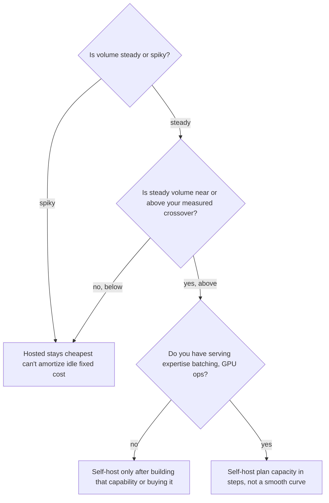

---
tags:
  - decision-frame
  - llmops-infra
  - cost
  - customer-facing
---
# What Will This Cost at Scale?

## 📝 Context

Customers extrapolate cost the way they'd extrapolate anything else: take the demo's
per-query price, multiply by production volume, done. That math is wrong in a
specific, predictable way — **a hosted API's cost is a smooth line; a self-hosted
model's cost is a staircase.** This frame gives you the shape of both curves so you
can tell a customer where they actually sit, not where a linear guess puts them.
**Lab 05 · Serving & Cost** (Phase 3) is where you measure the real numbers this
frame turns into a volume conversation.

> **Recommendation:** don't quote a single \$/query number and extrapolate it
> linearly in either direction. Hosted cost scales smoothly with usage (a line);
> self-host cost is flat within a capacity tier and jumps when you add hardware (a
> staircase). The crossover isn't a fixed \$ or volume — it's where your steady-state
> line crosses their staircase, and it moves with utilization.

## 🎯 The Two Cost Shapes

| | Hosted API | Self-host |
| --- | --- | --- |
| **Shape** | Linear — cost scales directly with tokens sent | Staircase — flat within a capacity tier, jumps when you add a GPU/instance |
| **Best at** | Low or spiky volume — you never pay for idle capacity | High, steady volume that keeps a tier's capacity busy |
| **The trap** | Assuming the per-token price never changes (committed-use/enterprise tiers usually beat list price at real volume) | Assuming capacity is infinitely elastic — it's stepped, and the step before you hit the ceiling matters |

## 🧭 Decision Flow

Spiky traffic loses to hosted regardless of average volume — a self-hosted GPU
billed 24/7 for traffic that shows up in bursts is paying for idle time most of the
day. The crossover conversation only starts once volume is steady enough to keep
capacity busy.

## 📊 The Numbers (illustrative — anchor to Lab 05's real measurement)

**Lab 05** measures real tokens/sec for a local model as
a **single, unbatched stream** — the worst case for self-host economics. Production
serving (vLLM/SGLang, this site's canonical cast for production serving) batches
many concurrent requests onto the same GPU, which is what actually makes self-host
competitive at volume:

| Serving mode | Effective throughput vs. Lab 05's single-stream number | Why |
| --- | --- | --- |
| Single stream (what Lab 05 measures) | 1× (baseline) | One request at a time — the floor, not a forecast |
| Batched production serving (vLLM/SGLang) | Roughly 5–20×, workload-dependent | Continuous batching keeps the GPU busy across many concurrent requests instead of idling between tokens |

> **Accuracy note:** the 5–20× batching multiplier is a directional, 2026-era rule
> of thumb — the real number depends on request concurrency, sequence length, and
> the serving stack's scheduler. Don't quote Lab 05's single-stream \$/1M-token
> number as your self-host cost at production volume; it's the input to a batching
> model, not the answer.

## 🧩 Worked Scenario: Moving 50,000 Queries/Day Off a Hosted API

A customer runs ~50k queries/day on a hosted 8B-class model and asks if self-hosting
would be cheaper.

- **Check the shape first** — is that volume steady through the day, or bursty
  (e.g. business hours only)? Steady 50k/day is a real candidate; the same volume
  crammed into a 2-hour burst mostly isn't — capacity would sit idle 22 hours a day.
- **Price the hosted line** — 50k queries/day at a hosted per-token rate
  (Lab 05's `cost.py` prints current published
  examples) gives a real \$/day figure — usually single-to-low-double digits at this
  volume for a small model.
- **Price the self-host staircase** — one GPU/instance at Lab 05's measured
  tokens/sec, batched, gives an effective capacity (queries/day that one tier can
  absorb). If 50k/day fits inside one tier with headroom, that tier's fixed cost is
  the number to compare — not a per-query figure.
- **The actual crossover** — usually sits where the hosted line's daily cost exceeds
  one tier's fixed daily cost *and* volume is steady enough to keep that tier busy.
  Below it, hosted wins on both simplicity and price. Right at it, run both numbers
  before committing — this is exactly the gap a linear extrapolation gets wrong.

## 🚨 Failure Path

The common mistake is **linear extrapolation in either direction**:

- **Under-provisioning self-host** — sizing capacity for today's average volume,
  then hitting the ceiling at the next traffic spike with no next tier ready. The
  staircase's step takes real lead time (procurement, setup); plan the jump before
  you need it, not after.
- **Over-provisioning self-host** — standing up production-scale serving for a
  pilot's volume "because it'll grow," and paying for idle capacity for months
  before the growth arrives. See [Managed API vs Self-Host](/decision-frames/managed-vs-self-host)'s
  failure path — this is the same mistake, sized wrong in the other direction.
- **Assuming hosted stays linear forever** — at genuinely high steady volume, list
  price is rarely the real price; committed-use and enterprise discounts change the
  crossover materially. Get the discounted rate in writing before ruling self-host
  out.

## 👁️ Audience Lens — Who Hears What

| | Engineer hears | Exec hears | Finance hears |
| --- | --- | --- | --- |
| **Hosted** | no capacity planning, just usage | a bill that scales with adoption — good for uncertain growth | a metered opex line, easy to forecast at low volume |
| **Self-host** | capacity tiers to plan and monitor, batching to tune | a step-shaped cost — flat, then a jump, repeat | a capex-like line; budget the jump before it's needed, not after |

## 🗣️ Talk Track

  
Say it like this — to an exec sizing production volume

  
"Don't take today's per-query cost and multiply it by tomorrow's volume — that's
  not how either option actually scales. The hosted price is a straight line: it
  grows with usage, but never needs a capital decision. Self-hosting is a staircase:
  flat and often cheaper once a tier of hardware is busy, but it jumps in steps, and
  under-sizing the jump is what causes outages at your next growth spurt. I'll show
  you both curves against your real, measured volume, and tell you where they
  cross — not before."

## ⚠️ Gotchas

- Multiplying a demo's per-query cost by production volume — neither curve is actually linear across the full range.
- Quoting Lab 05's single-stream self-host number as the production self-host cost — real serving batches requests; the single-stream number is a floor.
- Sizing self-host capacity for today's average without planning the next step — the staircase's jump has lead time.
- Assuming hosted list price holds at high volume — ask about committed-use or enterprise pricing before ruling self-host out.

## 🔗 Links

- **Lab 05 · Serving & Cost** (Phase 3) — measure the real numbers this frame extrapolates
- [Managed API vs Self-Host](/decision-frames/managed-vs-self-host) — the build-vs-buy call this frame sizes
- [The Real Cost of a RAG System](/decision-frames/rag-tco) — the other cost lines beyond serving (build, eval, maintenance)
