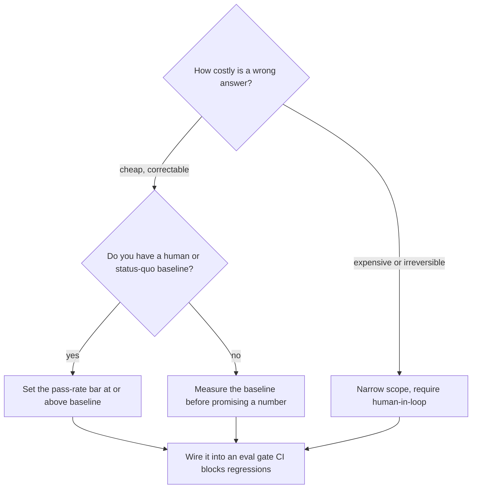

---
tags:
  - decision-frame
  - apps-agents
  - evals
  - customer-facing
---
# How Do We Know It's Good Enough?

## 📝 Context

Every AI deal reaches the same standoff: the customer says "make sure it never gets
it wrong," and the SE has to explain that's not how these systems work — without
sounding like they're lowering the bar. This frame gives you a defensible answer
that isn't a vibe: benchmark against the real alternative, agree what a failure
costs, and turn "good enough" into a number an [eval gate](/labs/04-eval-harness/)
enforces.

> **Recommendation:** never promise 100% accuracy. Set the bar relative to the
> **status quo** the system replaces (a human process has an error rate too — measure
> it), size the bar to **what a wrong answer costs**, and make "good enough" a
> tracked number with an agreed **decline/escalate** path for the cases that miss it —
> not a threshold nobody revisits after the demo.

## 🎯 What "Good Enough" Actually Depends On

| Question | Why it changes the bar |
| --- | --- |
| **What does a wrong answer cost?** | A stale FAQ answer and a wrong dosage are not the same bar — severity, not accuracy alone, sets the threshold. |
| **What's the status quo error rate?** | The system isn't competing against perfection — it's competing against the human or process it replaces. |
| **Can the system decline instead of guess?** | A system that says "I'm not sure, let me get a person" at 90% accuracy can beat a system that guesses at 95%. |
| **Who signs off on the number?** | Without an agreed owner, the bar gets renegotiated after every bad demo. |

## 🧭 Decision Flow

Severity comes first. A system with irreversible or expensive failure modes
(financial, medical, legal, anything that can't be undone) doesn't get a
pass-rate negotiation — it gets a narrower scope and a human in the loop. Only once
severity is handled does the conversation move to "what number clears the bar."

## 📊 The Numbers (illustrative — anchor to their real stakes and baseline)

There's no universal accuracy threshold — "good enough" is relative to stakes and
baseline, not a fixed percentage:

| Stakes | Illustrative bar | Failure handling |
| --- | --- | --- |
| Low (internal tool, easily correctable) | ~80–90% pass rate | Log and iterate; a wrong answer is a minor annoyance |
| Medium (customer-facing informational) | ~90–95%+ pass rate | Must decline gracefully on the rest, not guess |
| High (financial, medical, legal, irreversible) | No pass-rate substitute | Human-in-loop or narrow the scope until it's low-stakes |

> **Accuracy note:** these bands are directional, not sourced constants — the real
> number comes from measuring the status-quo process's own error rate and pricing
> the cost of a miss. A support team that gets it wrong 15% of the time today isn't
> beaten by an AI system that clears 90% and matches their decline behavior.

## 🧩 Worked Scenario: "We Need It to Never Be Wrong"

A customer asks for a guarantee before they'll sign off. Unpack the ask rather than
arguing with it:

- **"Never wrong"** — no system, human or AI, clears this. Reframe: what does *their
  current process* get wrong today, and how often?
- **They don't have that number.** — Common. Propose measuring it: sample 50 recent
  human-handled cases, grade them the same way [Lab 04](/labs/04-eval-harness/)
  grades the AI system.
- **The real requirement surfaces** — usually "don't let it confidently make things
  up" (a decline path) matters more than raw accuracy. That's cheaper to guarantee
  than perfection, and it's the thing that actually protects them.
- **Outcome** — an agreed pass-rate bar, benchmarked to their baseline, with a
  decline path for the rest — signed off before build starts, not argued about at
  demo.

## 🚨 Failure Path

The costly mistake is **chasing 100% before shipping anything** — a team spends
months trying to eliminate all model error, while a competitor ships at a
measured, agreed 92% with a good decline-and-escalate path and wins the account.

- **Symptom** — the project stalls in "just one more accuracy pass," with no agreed
  number that would let it ship.
- **Root cause** — no baseline was ever measured, so there's no defensible "good
  enough" to aim for — only an undefined "better," which never arrives.
- **Cost** — months of delay for a bar that was never going to be reachable, while
  the actual risk (confidently wrong answers with no decline path) goes unaddressed.
- **Fix** — measure the status-quo baseline, set the bar relative to it, ship with a
  decline path, and gate future changes against that number instead of re-litigating
  it every release.

The mirror-image failure is shipping with **no bar at all** — no eval set, no
threshold, no gate — and finding out the pass rate in production from an angry
customer instead of a CI run.

## 👁️ Audience Lens — Who Hears What

| | Engineer hears | Exec hears | End user hears |
| --- | --- | --- | --- |
| **The bar** | a concrete pass-rate threshold to build and test against | a number they're accountable for, benchmarked to the status quo | nothing directly — they just see fewer bad answers |
| **The decline path** | a required code path, not an edge case | the safety net that makes the bar defensible | "I'm not sure — let me get you a person," not a wrong guess |

## 🗣️ Talk Track

  
Say it like this — when a customer demands "never wrong"

  
"No system — AI or human — is never wrong, and I don't want to promise you
  something I can't hold. What I can do is measure how your current process performs
  today, set our bar at or above that, and build in a rule that the system says 'I'm
  not sure' instead of guessing when it's outside its confidence. That's a number I
  can show you every release, not a promise I make once and hope holds."

## ⚠️ Gotchas

- Promising 100% accuracy to close a deal — it will come back to bite the engagement the first time the system is wrong in front of the customer.
- Setting a bar against an imaginary "perfect" baseline instead of the real process being replaced.
- Treating the decline path as optional — a system that guesses confidently when it doesn't know is worse than one that says so.
- Agreeing a number once and never gating future changes against it — accuracy regresses silently without a CI gate.

## 🔗 Links

- [Lab 04 · Eval Harness](/labs/04-eval-harness/) — the gate that turns this bar into a CI check
- [Scoping an AI POC](/poc-playbooks/scoping-an-ai-poc) — where the bar gets agreed before build starts
- [Explaining a Hallucination](/talk-tracks/explaining-a-hallucination) — the talk track for when it misses the bar live
