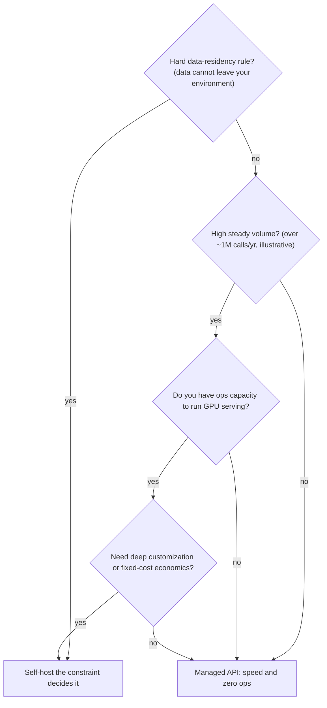

---
tags:
  - decision-frame
  - llmops-infra
  - customer-facing
---
# Managed API vs Self-Host

## 📝 Context

The first build-vs-buy question in almost every AI deal: do we call a hosted model
over an API, or run an open model on our own infrastructure? This frame gets a
customer to the right answer — and sets up the numbers conversation that follows.

> **Recommendation:** for most teams starting out, **managed API wins** — you're
> buying speed and zero ops. Self-hosting earns its keep at **high, steady volume**,
> under **hard data-residency rules**, or when you need **deep customization**. The
> crossover is about economics and constraints, not ideology.

## 🎯 The Two Options

| | Managed API | Self-host (open model) |
| --- | --- | --- |
| **What it is** | Call a hosted model (per-token billing) | Run an open model on your own / rented GPUs |
| **You're buying** | Speed, no ops, frontier quality | Control, privacy boundary, fixed-cost economics at scale |
| **Cost shape** | Variable, per-token — scales with usage | Mostly fixed — GPU capacity whether busy or idle |
| **Ops burden** | Near zero | Real: serving, scaling, upgrades, on-call |
| **Data boundary** | Leaves your environment (mitigable by enterprise terms) | Stays in your environment |
| **Time to first value** | Hours | Days to weeks |

## 🧭 Decision Flow

The order matters: a hard data rule (L4 governance) ends the conversation before
economics ever come up. Don't model cost for a customer who legally can't send data
to a hosted model — confirm the constraint first, then talk numbers.

## 📊 The Numbers (illustrative — verify against their volume)

The economics hinge on **utilization**. A managed API costs you only when you use
it; a GPU costs you whether it's busy or not. So self-hosting wins when you'd keep
the hardware busy.

| Scenario | Managed API | Self-host | Who wins |
| --- | --- | --- | --- |
| Pilot / spiky traffic | pennies–low \$\$ per day, pay-as-you-go | a GPU billed 24/7, mostly idle | **Managed** |
| High, steady traffic | per-token cost adds up linearly | fixed GPU cost amortized across heavy use | **Self-host** |

> **Accuracy note:** the "~1M calls/year" crossover is a *directional,
> workload-dependent* figure from 2026 enterprise sources — not a constant. Real
> crossover depends on model size, token lengths, GPU price, and utilization. Use it
> to frame the *shape* of the decision; compute the actual break-even against the
> customer's real numbers before putting a figure in writing.

## 🚨 Failure Path

The classic mistake is **self-hosting too early** — a team stands up GPU
infrastructure for a pilot doing a few thousand calls a day, then spends months on
serving and on-call while paying for idle hardware.

- **Symptom** — "We're running our own model," for a workload a managed API would serve for a few dollars a day.
- **Root cause** — treated self-hosting as the "serious" choice rather than an economics/constraints decision.
- **Cost** — idle GPU spend plus ops time that should have gone into the product. The model was never the bottleneck.
- **Fix** — start managed, instrument usage, revisit self-host when real volume and a constraint justify it.

The mirror-image failure is **ignoring a data constraint** until late — building on
a managed API, then discovering in security review that the data can't leave. That's
the first box in the flow; ask it first.

## 👁️ Audience Lens — Who Hears What

| | Engineer hears | Exec hears | Security / legal hears |
| --- | --- | --- | --- |
| **Managed** | no infra to run, fast iteration | variable cost, scales with use | data leaves our boundary — need enterprise terms |
| **Self-host** | we own the serving stack | capex-like fixed cost, ops headcount | data stays in our environment |

## 🗣️ Talk Track

  
Say it like this — to an exec

  
"Two paths. We can call a hosted model — fastest to value, you pay per use, and
  it scales with you. Or we run an open model ourselves — more control and it gets
  cheaper at high volume, but it's real infrastructure and headcount. My
  recommendation for where you are: start hosted, measure real usage, and only move
  in-house if the volume and your data rules justify it. We won't pay for an engine
  room you don't need yet."

  
Say it like this — when data residency comes up

  
"If your policy is that this data can't leave your environment, that decides
  it — we self-host, and I'll size the infrastructure to your volume. Let's confirm
  that rule with your security team before we talk cost, because it changes the
  whole architecture."

## ⚠️ Gotchas

- Quoting a cost before confirming the data-residency rule — the constraint can make the cost question moot.
- Treating "self-host" as automatically cheaper — it only wins at high, steady utilization.
- Forgetting the ops headcount in the self-host column — the GPU bill is rarely the biggest line.
- Assuming managed = data is unsafe — enterprise terms usually keep your data out of training; get it in writing.

## 🔗 Links

- [The Real Cost of a RAG System](/decision-frames/rag-tco) — total cost beyond the model call
- [AI Vocabulary for SAs](/foundations/ai-vocabulary-for-sas) — the governance/data-handling terms
- [The Four-Layer Map](/visuals/four-layer-map) — where this sits (L2 infra, L4 governance)
