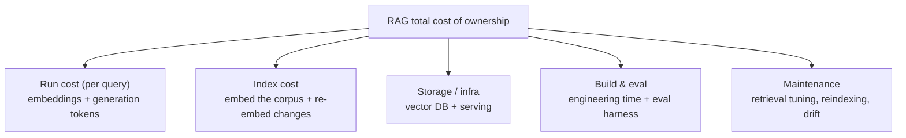

# Decision Frame · The Real Cost of a RAG System

> "What will this cost at scale?" is the second question every customer asks. The
> trap is answering with the token price — which is usually the *smallest* line
> item. This frame gets the whole cost on the table so the number you give
> survives contact with their finance team.

::: tip The short version
At any serious scale, **the model tokens are rarely the dominant cost.** The
durable costs are **engineering time, evaluation, and keeping the index fresh.**
Quote those, or your estimate is wrong by an order of magnitude.
:::

## The cost is more than the token bill

People price the top branch and forget the bottom three — where most of the money
actually goes once you're past a demo.

## State the numbers (illustrative — June 2026, verify before quoting)

| Line item | Representative figure | Notes |
| --- | --- | --- |
| Embeddings | ~\$0.02 / million tokens | Embedding ~1.5M words ≈ a few cents. Effectively free at small scale. |
| Generation (budget hosted LLM) | ~\$0.10–0.30 / M input, ~\$0.40–2.50 / M output | The visible "AI cost." Still often minor vs. the items below. |
| Vector DB | \$0 local → \$\$/mo hosted | A file on disk at small scale; a managed cluster at large scale. |
| Engineering build | weeks of an engineer's time | Usually the **largest first-year cost**, and the one teams omit. |
| Eval + maintenance | ongoing engineer time | Retrieval tuning, reindexing, watching for drift. Continuous, not one-off. |

::: warning Accuracy note
All token prices are **illustrative June-2026 figures and drift constantly** —
re-verify against the provider before putting a number in a proposal. The point
isn't the exact cents; it's the *ratio*: at small scale tokens are negligible, and
at every scale the human and operational costs dominate the model bill.
:::

## Worked scenario — sizing an internal support bot

A customer wants a RAG bot over ~50k support articles, ~5,000 employee queries a
day. You walk the branches:

  

Run cost

5k queries/day of embeddings + generation on a budget model — single-digit to low-double-digit \$/day (illustrative). Real, but not scary.

  

Index cost

Embedding 50k articles once is cheap; the discipline is re-embedding only changed articles, not the whole corpus.

  

Build & eval

The big number: engineering weeks to build it well, plus an eval harness so they know it's good. This dwarfs tokens.

  

Maintenance

Ongoing tuning as articles change and questions shift. Budget it, don't pretend it's zero.

  
What an SE does with this

  
When a customer fixates on per-query cost, gently redirect: "That's the line
  that's easy to estimate and usually the smallest. The number that decides your
  budget is the engineering and evaluation effort. Let's size that honestly." It
  reframes you as someone protecting their budget, not selling tokens.

## The failure path

The estimate that quotes only token cost — "it'll cost about \$20 a day" — and
omits the engineering, eval, and maintenance. Finance approves against the small
number; the project runs long; trust erodes when the real cost surfaces.

  

Symptom

A suspiciously tiny cost estimate that's all tokens, no people.

  

Root cause

Token price is the only number that's easy to look up, so it becomes the whole answer.

  

Fix

Quote all five branches. The token line is the footnote, not the headline.

## Audience lens

| | Engineer hears | Exec hears | Finance hears |
| --- | --- | --- | --- |
| Run cost | tokens per query, caching | predictable variable cost | the metered line, easy to model |
| Build & eval | the real work | time-to-value | the capex-like line that needs a budget |
| Maintenance | reindexing, drift | ongoing reliability | a recurring line, not a one-off |

## Talk track

  
Say it like this

  
"The AI usage itself is probably your smallest cost — likely a few dollars to
  low tens of dollars a day at your volume. The number that actually shapes the
  budget is the engineering to build it well and the evaluation to keep it
  trustworthy, plus ongoing upkeep as your content changes. I'd rather give you the
  honest full picture now than a token price that finance later finds out was a
  tenth of the real thing."

  Go deeper
  Whether to run the model hosted or in-house — which changes the run-cost shape —
  is the <a href="/decision-frames/managed-vs-self-host">Managed vs Self-Host</a>
  frame. The eval line item gets its own frame and lab in Phase 3
  (<code>labs/04-eval-harness</code>).

