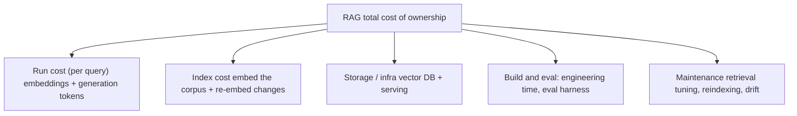

---
tags:
  - decision-frame
  - apps-agents
  - rag
  - customer-facing
---
# The Real Cost of a RAG System

## 📝 Context

"What will this cost at scale?" is the second question every customer asks. The trap
is answering with the token price — which is usually the *smallest* line item. This
frame gets the whole cost on the table so the number you give survives contact with
their finance team.

> **Recommendation:** at any serious scale, the model tokens are rarely the dominant
> cost. The durable costs are **engineering time, evaluation, and keeping the index
> fresh.** Quote those, or your estimate is wrong by an order of magnitude.

## 🎯 The Cost Is More Than the Token Bill

People price the top branch and forget the bottom three — where most of the money
actually goes once you're past a demo.

## 📊 The Numbers (illustrative — June 2026, verify before quoting)

| Line item | Representative figure | Notes |
| --- | --- | --- |
| Embeddings | ~\$0.02 / million tokens | Embedding ~1.5M words ≈ a few cents. Effectively free at small scale. |
| Generation (budget hosted LLM) | ~\$0.10–0.30 / M input, ~\$0.40–2.50 / M output | The visible "AI cost." Still often minor vs. the items below. |
| Vector DB | \$0 local → \$\$/mo hosted | A file on disk at small scale; a managed cluster at large scale. |
| Engineering build | weeks of an engineer's time | Usually the **largest first-year cost**, and the one teams omit. |
| Eval + maintenance | ongoing engineer time | Retrieval tuning, reindexing, watching for drift. Continuous, not one-off. |

> **Accuracy note:** all token prices are *illustrative June-2026 figures and drift
> constantly* — re-verify against the provider before putting a number in a proposal.
> The point isn't the exact cents; it's the *ratio*: at small scale tokens are
> negligible, and at every scale the human and operational costs dominate the model
> bill.

## 🧩 Worked Scenario: Sizing an Internal Support Bot

A customer wants a RAG bot over ~50k support articles, ~5,000 employee queries a
day. You walk the branches:

- **Run cost** — 5k queries/day of embeddings + generation on a budget model: single-digit to low-double-digit \$/day (illustrative). Real, but not scary.
- **Index cost** — embedding 50k articles once is cheap; the discipline is re-embedding only changed articles, not the whole corpus.
- **Build & eval** — the big number: engineering weeks to build it well, plus an eval harness so they know it's good. This dwarfs tokens.
- **Maintenance** — ongoing tuning as articles change and questions shift. Budget it; don't pretend it's zero.

When a customer fixates on per-query cost, gently redirect: "That's the line that's
easy to estimate and usually the smallest. The number that decides your budget is
the engineering and evaluation effort — let's size that honestly." It reframes you
as someone protecting their budget, not selling tokens.

## 🚨 Failure Path

The estimate that quotes only token cost — "it'll cost about \$20 a day" — and omits
the engineering, eval, and maintenance. Finance approves against the small number,
the project runs long, and trust erodes when the real cost surfaces.

- **Symptom** — a suspiciously tiny cost estimate that's all tokens, no people.
- **Root cause** — token price is the only number that's easy to look up, so it becomes the whole answer.
- **Fix** — quote all five branches. The token line is the footnote, not the headline.

## 👁️ Audience Lens — Who Hears What

| | Engineer hears | Exec hears | Finance hears |
| --- | --- | --- | --- |
| **Run cost** | tokens per query, caching | predictable variable cost | the metered line, easy to model |
| **Build & eval** | the real work | time-to-value | the capex-like line that needs a budget |
| **Maintenance** | reindexing, drift | ongoing reliability | a recurring line, not a one-off |

## 🗣️ Talk Track

  
Say it like this

  
"The AI usage itself is probably your smallest cost — likely a few dollars to
  low tens of dollars a day at your volume. The number that actually shapes the
  budget is the engineering to build it well and the evaluation to keep it
  trustworthy, plus ongoing upkeep as your content changes. I'd rather give you the
  honest full picture now than a token price that finance later finds out was a tenth
  of the real thing."

## ⚠️ Gotchas

- Quoting only the per-query token line — it's usually the smallest of five cost branches.
- Re-embedding the whole corpus on every change — embed only what changed, or the index cost balloons.
- Treating evaluation as a one-time setup — it's a recurring line, like the maintenance it enables.
- Forgetting the vector DB / serving infra jumps from \$0 (local) to a real bill at scale.

## 🔗 Links

- [Managed API vs Self-Host](/decision-frames/managed-vs-self-host) — which changes the run-cost shape
- [Scoping an AI POC](/poc-playbooks/scoping-an-ai-poc) — where the eval line item gets defined
- [The Four-Layer Map](/visuals/four-layer-map) — cost lives at L2
