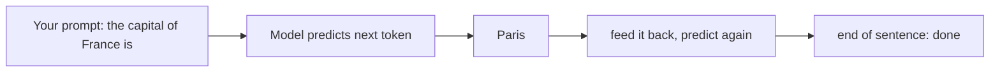

---
tags:
  - foundations
  - apps-agents
---
# How LLMs Actually Work (no math)

## 📝 Context

Enough of a working model to be dangerous in a meeting — without a single equation.
The goal isn't to make you an ML researcher; it's so that when a customer asks "why
did it make that up?" you can answer truthfully and calmly instead of changing the
subject.

A large language model does exactly one thing: **given some text, it predicts the
next chunk of text.** It has read an enormous amount of writing and learned the
statistical shape of language — which words tend to follow which. Given a prompt, it
predicts the most likely continuation, one token at a time, feeding each prediction
back in to predict the next.

> **A "token" is just a piece of a word.** Models read tokens — roughly 3–4
> characters, about ¾ of a word on average (illustrative; varies by language). It
> matters because you're billed per token and the context window is measured in
> tokens, not words. "$0.30 per million tokens" is roughly a million ¾-words.

Everything impressive an LLM does — summarizing, coding, reasoning — is this same
next-token prediction, scaled up. It isn't looking anything up or consulting a
database. It's continuing the pattern. You don't need the transformer math to be
effective; you need the *behavior*.

## 🎯 Four Mental Models That Explain Almost Every Behavior

### 1. The context window is its only working memory

The model can only "see" what's in the current prompt — the **context window**.
Everything outside it doesn't exist to the model. Previous conversation, your
documents, yesterday's correct answer: unless it's in the window *right now*, it's
gone. This is why RAG exists — it puts the *relevant* documents into the window at
the moment you ask.

> "The model has no memory between calls — every request starts from a blank slate.
> So 'it forgot what I told it' isn't a bug, it's the architecture. We design around
> it by deciding what to put in the window each time."

### 2. The training cutoff means it doesn't know recent or private things

The model learned from data up to a certain date — its **training cutoff** — and
from *public* text. It has never seen your internal wiki, last week's news, or
anything proprietary. Ask it about those and you get either an honest "I don't know"
or a confident fabrication. Which brings us to the question every customer asks.

### 3. Hallucination is the system working as designed, not a malfunction

Because the model's job is to produce *plausible continuation*, it produces
plausible-sounding text even when it has no grounding for it. It doesn't know what
it doesn't know — there's no internal "confidence meter" before it invents a
citation. A **hallucination** is the model doing what it always does (predict likely
text) in a case where likely text happens to be false.

  
Say it like this

  
"It's not lying and it's not broken — it's a prediction engine, and sometimes
  the most fluent-sounding answer isn't the true one. The fix isn't a smarter model,
  it's grounding: we feed it your actual documents and tell it to answer only from
  those and say 'I don't know' otherwise. That's what turns a demo into something you
  can trust."

### 4. Temperature is a creativity dial, not an accuracy dial

When the model picks the next token, **temperature** controls how much it favors the
single most-likely option versus sampling less-likely ones. Low → repetitive,
deterministic. High → varied, creative, more prone to drift. It's a knob for
*style*, not *correctness* — turning it down reduces randomness but does not make the
model know more.

## 🧩 Worked Scenario: A Demo That Hallucinated On Stage

You're demoing a support assistant. Someone asks about a product feature that
shipped *after* the model's training cutoff and isn't in the retrieved docs. Asked a
direct question, the model produces a confident, detailed, **wrong** answer. The
room goes quiet.

- **What happened** — no grounding in context for that feature, so the model predicted plausible text, and plausible ≠ true.
- **What it wasn't** — not a "dumb model." A frontier model does the same thing; size doesn't fix ungrounded questions.
- **The real fix** — retrieval that covers the feature, plus a system instruction to refuse when context is missing.
- **The recovery line** — name it honestly in the room; it builds trust faster than pretending it didn't happen.

## ⚠️ Gotchas

- "A bigger/smarter model will fix the hallucinations" — no; an ungrounded question gets a confident guess from any model. Grounding fixes it.
- "Turn the temperature down for accuracy" — temperature controls randomness, not knowledge.
- "It remembers our last conversation" — only if you put that history back in the context window.
- Explaining transformers/attention to a customer — wrong altitude; talk behavior, not architecture.

## 🔗 Links

- [The Four-Layer Map](/foundations/the-four-layer-map) — where this sits and what depends on it
- [AI Vocabulary for SAs](/foundations/ai-vocabulary-for-sas) — the terms above, defined
- [Explaining a Hallucination](/talk-tracks/explaining-a-hallucination) — the recovery script
