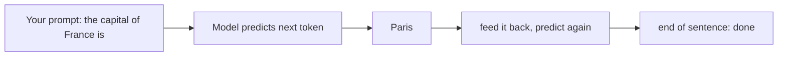

# How LLMs Actually Work (no math)

> Enough of a working model to be dangerous in a meeting — without a single
> equation. The goal isn't to make you an ML researcher. It's so that when a
> customer asks "why did it make that up?" you can answer truthfully and calmly
> instead of changing the subject.

## The one idea everything else hangs on

A large language model does exactly one thing: **given some text, it predicts the
next chunk of text.** That's it. It has read an enormous amount of writing and
learned the statistical shape of language — which words tend to follow which. When
you give it a prompt, it predicts the most likely continuation, one token at a
time, feeding each prediction back in to predict the next.

::: tip A "token" is just a piece of a word
Models don't read whole words — they read **tokens**, roughly 3–4 characters or
about ¾ of a word on average (illustrative; it varies by language and text).
"Tokenization" matters because you're billed per token and the context window is
measured in tokens, not words. When you see pricing like "$0.30 per million
tokens," that's roughly a million ¾-words.
:::

Everything impressive an LLM does — summarizing, coding, reasoning through a
problem — is this same next-token prediction, scaled up. It's not looking
anything up. It's not consulting a database. It's continuing the pattern.

## Four mental models that explain almost every behavior

### 1. The context window is its only working memory

The model can only "see" what's in the current prompt — the **context window**.
Everything outside it doesn't exist to the model. Previous conversation, your
documents, the answer to a question it got right yesterday: unless it's in the
window *right now*, it's gone. This is why RAG exists — it's the trick of putting
the *relevant* documents into the window at the moment you ask.

  
What an SE says about this

  
"The model has no memory between calls — every request starts from a blank
  slate. So 'it forgot what I told it' isn't a bug, it's the architecture. We
  design around it by deciding what to put in the window each time."

### 2. The training cutoff means it doesn't know recent or private things

The model learned from data up to a certain date — its **training cutoff** — and
from *public* text. It has never seen your internal wiki, last week's news, or
anything proprietary. Ask it about those and you get one of two things: an honest
"I don't know," or a confident fabrication. Which brings us to the question every
customer eventually asks.

### 3. Hallucination is the system working as designed, not a malfunction

Because the model's job is to produce *plausible continuation*, it will produce
plausible-sounding text even when it has no grounding for it. It doesn't know what
it doesn't know — there's no internal "confidence meter" that fires before it
invents a citation. A **hallucination** is the model doing exactly what it always
does (predict likely text) in a case where likely text happens to be false.

  
Say it like this

  
"It's not lying and it's not broken — it's a prediction engine, and sometimes
  the most fluent-sounding answer isn't the true one. The fix isn't a smarter
  model, it's grounding: we feed it your actual documents and tell it to answer
  only from those and say 'I don't know' otherwise. That's what turns a demo into
  something you can trust."

### 4. Temperature is a creativity dial, not an accuracy dial

When the model picks the next token, **temperature** controls how much it favors
the single most-likely option versus sampling from less-likely ones. Low
temperature → repetitive, deterministic, "safe." High temperature → varied,
creative, more prone to drift. It's a knob for *style*, not *correctness* —
turning it down reduces randomness but does not make the model know more.

## Worked scenario — a demo that hallucinated on stage

You're demoing a support assistant. Someone asks about a product feature that
shipped *after* the model's training cutoff and isn't in the retrieved docs. The
model, asked a direct question, produces a confident, detailed, **wrong** answer.
The room goes quiet.

  

What happened

No grounding in context for that feature → model predicted plausible text → plausible ≠ true.

  

What it wasn't

Not a "dumb model." A frontier model does the same thing. Size doesn't fix ungrounded questions.

  

The real fix

Retrieval that covers the feature, plus a system instruction to refuse when context is missing.

  

The recovery line

Name it honestly in the room — it builds trust faster than pretending it didn't happen.

  Go deeper
  The customer-facing recovery script for exactly this moment is the
  <code>talk-tracks/explaining-a-hallucination</code> card (Phase 1). The
  retrieval-side fix is <code>labs/02-production-rag</code> (Phase 2).

## What you do *not* need to know

You don't need the transformer architecture, attention math, or how training
works to be effective as an SE. Those matter to the people building models. Your
job is the *behavior* — what the model can and can't do, why it fails, and how to
explain that to someone deciding whether to trust it. The four models above carry
~90% of the conversations you'll actually have (illustrative, but not by much).

---

*Deliberately non-mathematical and simplified — a working mental model for
translation, not an ML curriculum. The simplifications here are honest ones: where
this glosses detail, it doesn't mislead about behavior.*
