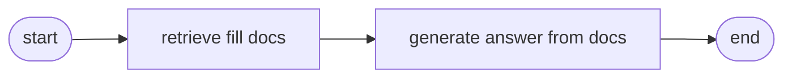
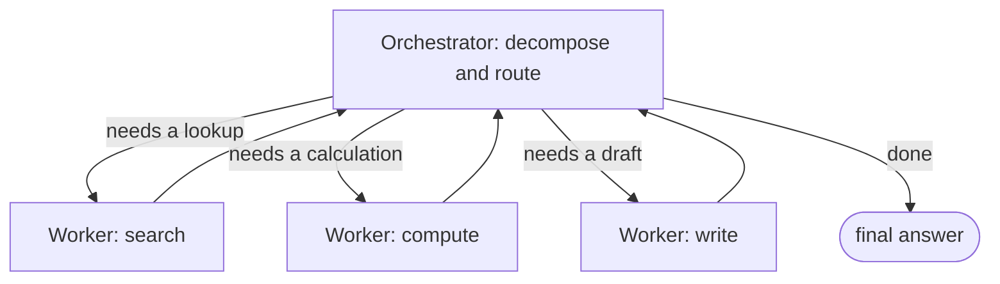

---
tags:
  - foundations
  - apps-agents
  - agents
---
# LangGraph in 10 Minutes

## 📝 Context

A beginner's mental model for the orchestration framework this site standardizes
on. You don't need to *write* LangGraph to be effective as an SE — but you need to
read a diagram of an agent system and know what the boxes and arrows mean. That's
what this page is for.

> **Why LangGraph at all?** This site standardizes labs on **LangGraph** — most
> production mindshare in 2026, safe to recommend without caveats (recorded in
> [ADR 001](/decisions/001-langgraph-orchestration)). The concepts below — state,
> nodes, edges — transfer to every other framework, so none of this is wasted if the
> tool changes.

## 🎯 The Core Idea: An Agent Workflow Is a Graph

A complex LLM workflow isn't one prompt — it's a series of steps, some of which loop
or branch. LangGraph models that as a **graph**: boxes (nodes) do work, arrows
(edges) decide what runs next, and a shared **state** object is passed along and
updated at each step. If you've ever drawn a flowchart, you already understand the
shape.

| Concept | What it is | Whiteboard equivalent |
| --- | --- | --- |
| **State** | A shared object passed between steps, holding everything so far (question, retrieved docs, draft answer…). | The notepad everyone writes on. |
| **Node** | A function that does one unit of work — call the model, search the docs, use a tool. | A box. |
| **Edge** | The connection deciding what runs next; a **conditional edge** branches based on state. | An arrow (sometimes a fork). |

## 🧩 A Minimal Example

The smallest useful shape: a node that retrieves, a node that generates, wired in
sequence.

```python
# Illustrative — LangGraph's API evolves; check current docs before copying.
from langgraph.graph import StateGraph, END
from typing import TypedDict

class State(TypedDict):
    question: str
    docs: list[str]
    answer: str

def retrieve(state):      # node 1: fill state["docs"]
    return {"docs": search(state["question"])}

def generate(state):      # node 2: answer from the docs
    return {"answer": llm(state["question"], state["docs"])}

graph = StateGraph(State)
graph.add_node("retrieve", retrieve)
graph.add_node("generate", generate)
graph.set_entry_point("retrieve")
graph.add_edge("retrieve", "generate")
graph.add_edge("generate", END)
app = graph.compile()
```

That graph looks like this:



The payoff isn't this simple case — it's that the *same model* extends to loops and
branches without the code turning into spaghetti.

## 🏗️ Where It Earns Its Keep: The Orchestrator-Worker Pattern

The research is clear: production multi-agent systems overwhelmingly use a
**hub-and-spoke orchestrator-worker** pattern, not a free-for-all "swarm." One
orchestrator decomposes the task and routes to specialized workers, then assembles
the result. LangGraph's conditional edges express exactly this.



The single biggest design decision in an agent system is the orchestrator — how it
breaks a request into steps. Get that right and the workers are simple; get it wrong
and no amount of model quality saves you. When a customer asks "how reliable is the
agent?", they're really asking about the orchestrator.

## ✅ What You Actually Need to Take Away

- **It's a flowchart** — nodes do work, edges decide order, state is the shared notepad.
- **Branching = conditional edges** — "if the answer's incomplete, loop back" is one edge, not a rewrite.
- **Hub-and-spoke wins** — one orchestrator, specialized workers; not a mesh of equal agents.
- **The orchestrator is the risk** — task-decomposition quality is the #1 thing that makes an agent reliable.

<div class="sp-say">
  <div class="sp-label">Say it like this</div>
  <p>"An agent system is really a flowchart the AI runs. There's a coordinator that
  breaks your request into steps and hands each to a specialist — search this,
  calculate that, draft this — then puts the answer together. Most of the engineering
  effort, and most of the reliability, lives in that coordinator."</p>
</div>

## 🔗 Links

- [ADR 001 — LangGraph as orchestration standard](/decisions/001-langgraph-orchestration) — why this tool
- [Do We Even Need an Agent?](/decision-frames/do-we-need-an-agent) — when this pattern is overkill
- [Visual · The Four-Layer Map](/visuals/four-layer-map) — agents sit in L1
