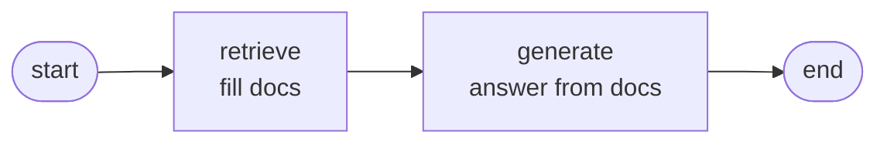
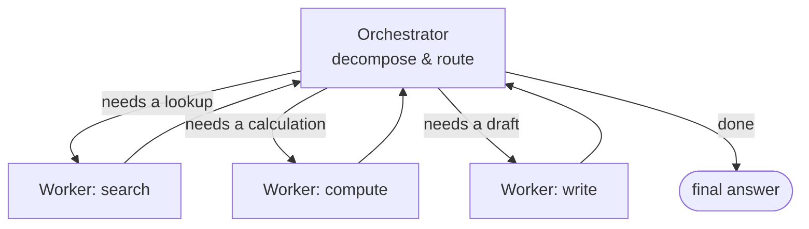

# LangGraph in 10 Minutes

> A beginner's mental model for the orchestration framework this site
> standardizes on. You don't need to write LangGraph to be effective as an SE —
> but you need to be able to read a diagram of an agent system and know what the
> boxes and arrows mean. That's what this page is for.

::: tip Why LangGraph at all?
This site standardizes labs on **LangGraph** because it has the most production
mindshare in 2026 and is safe to recommend without caveats. That's a deliberate
decision, recorded in ADR 001 (`decisions/001-langgraph-orchestration`, built in
Phase 1). The *concepts* below — state, nodes, edges — transfer to every other
orchestration framework, so this isn't wasted if the tool changes.
:::

## The core idea: an agent workflow is a graph

A complex LLM workflow isn't one prompt — it's a series of steps, some of which
loop or branch. LangGraph models that as a **graph**: boxes (nodes) do work,
arrows (edges) decide what runs next, and a shared **state** object is passed
along and updated at each step. If you've ever drawn a flowchart on a whiteboard,
you already understand the shape.

Three concepts carry the whole thing:

| Concept | What it is | Whiteboard equivalent |
| --- | --- | --- |
| **State** | A shared object passed between steps, holding everything so far (the question, retrieved docs, draft answer…). | The notepad everyone writes on. |
| **Node** | A function that does one unit of work — call the model, search the docs, use a tool. | A box. |
| **Edge** | The connection deciding what runs next; a **conditional edge** branches based on state. | An arrow (sometimes a fork). |

## A minimal example

Here's the smallest useful shape: a node that retrieves, a node that generates,
wired in sequence.

```python
# Illustrative — LangGraph's API evolves; check current docs before copying.
from langgraph.graph import StateGraph, END
from typing import TypedDict

class State(TypedDict):
    question: str
    docs: list[str]
    answer: str

def retrieve(state):      # node 1: fill state["docs"]
    return {"docs": search(state["question"])}

def generate(state):      # node 2: answer from the docs
    return {"answer": llm(state["question"], state["docs"])}

graph = StateGraph(State)
graph.add_node("retrieve", retrieve)
graph.add_node("generate", generate)
graph.set_entry_point("retrieve")
graph.add_edge("retrieve", "generate")
graph.add_edge("generate", END)
app = graph.compile()
```

That graph looks like this:



The payoff isn't this simple case — it's that the *same model* extends to loops
and branches without the code turning into spaghetti.

## Where it earns its keep: the orchestrator-worker pattern

The research is clear: production multi-agent systems overwhelmingly use a
**hub-and-spoke orchestrator-worker** pattern, not a free-for-all "swarm." One
orchestrator decomposes the task and routes to specialized workers, then
assembles the result. LangGraph's conditional edges express exactly this.



<div class="ai-context">
  <div class="ai-label">What an SE says about this</div>
  <p>"The single biggest design decision in an agent system is the orchestrator —
  how it breaks a request into steps. Get that right and the workers are simple.
  Get it wrong and no amount of model quality saves you. When a customer asks 'how
  reliable is the agent?', they're really asking about the orchestrator."</p>
</div>

## What you actually need to take away

<div class="sp-band">
  <div class="sp-step"><div class="sp-h">It's a flowchart</div><div class="sp-d">Nodes do work, edges decide order, state is the shared notepad.</div></div>
  <div class="sp-step"><div class="sp-h">Branching = conditional edges</div><div class="sp-d">"If the answer's incomplete, loop back" is one edge, not a rewrite.</div></div>
  <div class="sp-step"><div class="sp-h">Hub-and-spoke wins</div><div class="sp-d">One orchestrator, specialized workers. Not a mesh of equal agents.</div></div>
  <div class="sp-step"><div class="sp-h">The orchestrator is the risk</div><div class="sp-d">Task decomposition quality is the #1 thing that makes an agent reliable or not.</div></div>
</div>

<div class="sp-say">
  <div class="sp-label">Say it like this</div>
  <p>"An agent system is really a flowchart the AI runs. There's a coordinator that
  breaks your request into steps and hands each to a specialist — search this,
  calculate that, draft this — then puts the answer together. Most of the
  engineering effort, and most of the reliability, lives in that coordinator."</p>
</div>

<div class="ai-deeper">
  <span class="ai-label">Go deeper</span>
  You'll build a real hub-and-spoke system with LangGraph and one MCP tool in
  <code>labs/03-agent-system</code> (Phase 2). The "do we even need an agent?"
  decision frame (Phase 1/3) covers when this pattern is overkill.
</div>

---

*Code is illustrative and simplified to teach the shape; LangGraph's API changes,
so verify against current docs before building. The conceptual model (state /
nodes / edges, hub-and-spoke) is durable across frameworks.*
