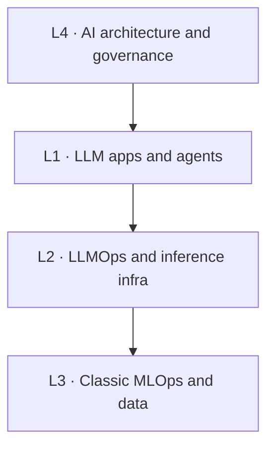

---
tags:
  - foundations
  - architecture-governance
---
# The Four-Layer Map

## 📝 Context

The one mental model the rest of this site hangs on. When a customer describes an
"AI problem," your first job is to locate *which layer* they're actually talking
about — because the layer determines who's in the room, what it costs, and how you
explain it.

"AI engineering" is not one field. The most useful framing in 2026 — the one
enterprise reference architectures and engineer roadmaps both converge on —
separates the **application layer** (where most engineering jobs now sit) from the
**infrastructure** beneath it, the **classic ML/data** discipline it grew out of,
and the **architecture & governance** concerns that wrap all of it.

## 🗺️ The Four Layers

| Layer | Name | What lives here | Who owns it |
| --- | --- | --- | --- |
| **L1** | LLM apps & agents | RAG, agents, prompt/context engineering, evals, orchestration, MCP/A2A, multi-agent | App / product engineers |
| **L2** | LLMOps & inference infra | Serving (vLLM/SGLang), quantization, GPU, vector DBs, gateways, LLM observability, cost/latency | Platform / infra engineers |
| **L3** | Classic MLOps & data | Training pipelines, feature stores, registries, experiment tracking, CI/CD for ML, drift | ML / data engineers |
| **L4** | AI architecture & governance | Reference architectures, build-vs-buy, guardrails, evaluation strategy, NIST / EU AI Act / ISO 42001 | Architects, security, legal, exec |

> **Read the arrows as "depends on."** An L1 chatbot depends on L2 serving a model
> fast and cheaply, which depends on L3 disciplines for anything you train yourself,
> all bounded by L4 decisions about what you're allowed to build and how you prove
> it's safe. Most *new* engineering work sits in L1; most *cost and risk* sit in L2
> and L4 — exactly where an SE earns their keep.

## 🎯 Why This Matters in the Room

Most online "AI engineer roadmaps" collapse L1–L4 into a single 12-month linear
path. That's fine for a learner and useless in a meeting. The map's real value is
**triage**: a customer says "we want an AI assistant for our support docs," and in
ten seconds you can place it — L1 (it's a RAG app), with L2 questions coming fast
(what will it cost to serve?) and an L4 flag waving (is their data going to a
third-party model?). You've turned a vague ask into three concrete workstreams
before anyone's opened a laptop.

## 🧩 Worked Scenario: Placing a Real Ask

A prospect says: *"We want to put a chatbot on our internal wiki so employees stop
pinging the ops team."* The map doing its job:

- **L1 · the ask itself** — this is RAG over the wiki, the visible product; retrieval quality decides whether it's trusted.
- **L2 · the cost question** — which model serves it, hosted or self-run, and per-query cost and latency at their volume.
- **L3 · usually skipped** — no model training here; L3 only enters if they later fine-tune on their own data.
- **L4 · the quiet blocker** — does the wiki contain HR or customer PII, and where does it go? This can stop the deal — surface it early.

  
Say it like this

  
"What you're describing is a retrieval system — the AI reads your wiki before it
  answers, so it's grounded in your docs, not making things up. The build is
  straightforward. The two questions I'd nail down early are what it costs to run at
  your volume, and whether anything in that wiki can't leave your environment —
  because that changes the architecture, not just the price."

## 🚨 Failure Path

The classic SE mistake is **answering at the wrong layer**. The customer asks an L4
governance question ("is our data training their model?") and the engineer answers
with L1 implementation detail ("we use RAG with hybrid search"). Both true; only one
is responsive. The map keeps you honest about which question you're actually being
asked — so you can say "good question, that's a different layer, let me come back to
it" instead of bluffing.

## ⚠️ Gotchas

- Treating the layers as rigid — real systems blur them; the map is a thinking tool, not a standard.
- Jumping to L1 build talk before the L4 data question — the governance answer can change the whole architecture.
- Assuming every AI project touches L3 — most app work never trains a model.

## 🔗 Links

- [Visual · The Four-Layer Map](/visuals/four-layer-map) — the dual-labeled whiteboard version you actually draw
- [How LLMs Actually Work](/foundations/how-llms-actually-work) — what sits inside L1
- [Managed API vs Self-Host](/decision-frames/managed-vs-self-host) — the L2/L4 decision in practice
