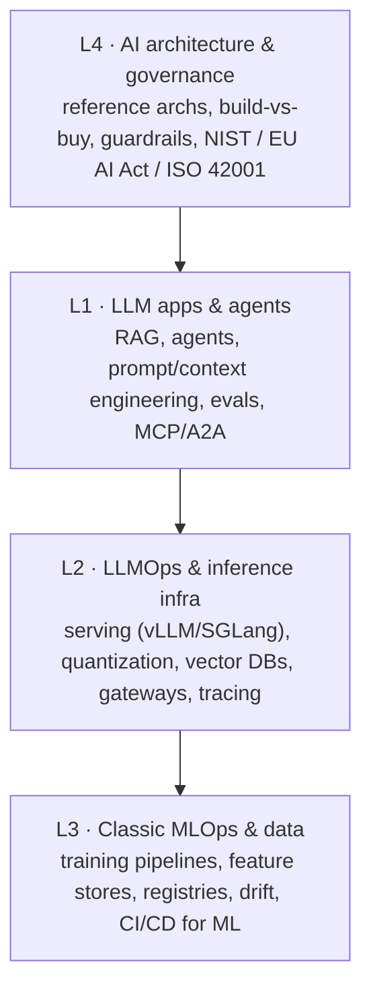

# The Four-Layer Map

> The one mental model the rest of this site hangs on. When a customer describes
> an "AI problem," your first job is to locate *which layer* they're actually
> talking about — because the layer determines who's in the room, what it costs,
> and how you explain it.

"AI engineering" is not one field. The most useful framing in 2026 — the one
enterprise reference architectures and engineer roadmaps both converge on —
separates the **application layer** (where most engineering jobs now sit) from
the **infrastructure** beneath it, the **classic ML/data** discipline it grew out
of, and the **architecture & governance** concerns that wrap all of it.

## The four layers

| Layer | Name | What lives here | Who owns it |
| --- | --- | --- | --- |
| **L1** | LLM apps & agents | RAG, agents, prompt/context engineering, evals, orchestration, MCP/A2A, multi-agent | App / product engineers |
| **L2** | LLMOps & inference infra | Serving (vLLM/SGLang), quantization, GPU, vector DBs, gateways, LLM observability, cost/latency | Platform / infra engineers |
| **L3** | Classic MLOps & data | Training pipelines, feature stores, registries, experiment tracking, CI/CD for ML, drift | ML / data engineers |
| **L4** | AI architecture & governance | Reference architectures, build-vs-buy, guardrails, evaluation strategy, NIST / EU AI Act / ISO 42001 | Architects, security, legal, exec |

::: tip Read the arrows as "depends on"
An **L1** chatbot depends on **L2** serving it a model fast and cheaply, which
depends on **L3** disciplines for anything you train yourself, all bounded by
**L4** decisions about what you're allowed to build and how you'll prove it's
safe. Most *new* engineering work sits in L1; most *cost and risk* sits in L2 and
L4. That gap is exactly where an SE earns their keep.
:::

## Why this matters in the room

Most online "AI engineer roadmaps" collapse L1–L4 into a single 12-month linear
path. That's fine for a learner and useless in a meeting. The map's real value is
**triage**: a customer says "we want an AI assistant for our support docs," and
in ten seconds you can place it — L1 (it's a RAG app), with L2 questions coming
fast (what will it cost to serve?), and an L4 flag waving (is their data going to
a third-party model?). You've turned a vague ask into three concrete workstreams
before anyone's opened a laptop.

### Worked scenario — placing a real ask

A prospect says: *"We want to put a chatbot on our internal wiki so employees
stop pinging the ops team."* Here's the map doing its job:

  

L1 · the ask itself

This is RAG over the wiki. The visible product. Retrieval quality decides whether it's trusted.

  

L2 · the cost question

Which model serves it, hosted or self-run, what's per-query cost and latency at their volume.

  

L3 · usually skipped

No model training here. L3 only enters if they later fine-tune on their own data.

  

L4 · the quiet blocker

Does the wiki contain HR or customer PII? Where does it go? This can stop the deal — surface it early.

  
Say it like this

  
"What you're describing is a retrieval system — the AI reads your wiki before it answers, so it's grounded in your docs, not making things up. The build is straightforward. The two questions I'd want to nail down early are what it costs to run at your volume, and whether anything in that wiki can't leave your environment — because that changes the architecture, not just the price."

## The failure mode this map prevents

The classic SE mistake is **answering at the wrong layer**. The customer asks an
L4 governance question ("is our data training their model?") and the engineer
answers with L1 implementation detail ("we use RAG with hybrid search"). Both are
true; only one is responsive. The map keeps you honest about which question you're
actually being asked — and lets you say "good question, that's a different layer,
let me come back to it" instead of bluffing.

## How the rest of this site uses the map

Every lesson, lab, and decision frame is tagged to a layer. If you only ever
internalize one thing here, make it this: **before you solve an AI problem, place
it.** The layer tells you who needs to be in the room and what they'll each care
about.

  Go deeper
  The signature, fully-drawn version of this diagram — dual-labeled for technical
  and non-technical audiences — lives in <code>visuals/four-layer-map</code> (built
  in Phase 1). This page is the on-ramp; that one is the whiteboard you actually draw.

---

*The four-layer framing is synthesized from 2026 enterprise reference
architectures and practitioner roadmaps. Layer boundaries are a thinking tool,
not a standard — real systems blur them, and that's fine.*
