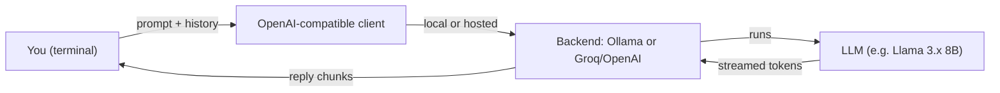

---
tags:
  - lab
  - apps-agents
---
# Lab 01 · First LLM App

> [AI Engineering Studio](/) › [Labs](/labs/) · ⏱ ~1 hour · **Beginner** · Cost: **$0**

You'll build a working LLM app — a streaming chat CLI and a function-calling
example. It's **provider-agnostic**: run it against a local model via
[Ollama](https://ollama.com) (the default — $0, private, great on Apple Silicon) or
a free hosted endpoint like Groq (instant, no local compute — ideal on an Intel/older
Mac or a locked-down laptop). Same code either way; you pick the backend in `.env`.
See [Choosing a Model Backend](/labs/model-backends) first.

> **Three-layer reading model.** This lab is written for three readers at once. The
> **main track** (the numbered steps) is completable with general technical
> experience and no prior AI knowledge. Inline **context** boxes explain what an SE
> would say about each step. **Go-deeper** pointers link to the engineering detail if
> you want it. You won't be stranded and you won't be bored.

## What you build

| Part | File | What it teaches |
| --- | --- | --- |
| Streaming chat CLI | `chat.py` | The core LLM-app loop: message → model → streamed reply → remember it |
| Function calling | `tools.py` | Letting the model call *your* code, then answer from the result |

## Architecture



Your Python script is a thin client that sends the conversation and prints what
streams back. The model runs either locally (Ollama) or behind a hosted API — the
code doesn't care, because both speak the OpenAI API.

<div class="ai-context">
  <div class="ai-label">What an SE says about this</div>
  <p>"This is the same shape as a production LLM app — the only difference is where
  the model runs. Local for privacy and $0, hosted for speed without local hardware.
  The structure is identical, which is exactly why it's a real skill, not a toy."</p>
</div>

## Prerequisites

- **Python 3.10+** and `pip`.
- **A model backend** — pick one in [Choosing a Model Backend](/labs/model-backends):
  - *Local (default):* [Ollama](https://ollama.com) installed and running, plus ~5 GB disk for the model. No GPU required; an 8B model runs on CPU, just slower (use `llama3.2:3b` on older hardware).
  - *Hosted:* a free [Groq](https://console.groq.com) API key — no local compute at all.
- A terminal.

## Quick Start

```bash
cd labs/01-first-llm-app
make setup        # install deps (openai client + dotenv)
make env          # create .env from the template

# --- Local (Apple Silicon): leave MODEL_BACKEND=ollama, then:
make pull         # download the model (one-time, a few GB)

# --- Hosted (Intel/older Mac, or no local compute): edit .env →
#     MODEL_BACKEND=groq and GROQ_API_KEY=...   (no pull needed)

make chat         # start chatting
make tools        # see the model call a function and answer from the result
```

`make help` lists every target. Override the model with `make chat MODEL=...`.

## Detailed Setup

### Step 1 · Streaming chat

Run `make chat` and talk to the model. Watch the reply appear token by token —
that streaming is what makes a chat app feel alive instead of frozen.

Open `chat.py` and read the loop. The whole app is four moves: collect a message,
send the running conversation, stream the reply, append it to history. The model
has **no memory of its own** — `messages` is the memory, and we resend it every
turn.

<div class="ai-context">
  <div class="ai-label">What an SE says about this</div>
  <p>"When a customer says 'it forgot what I told it,' this is why — the model only
  knows what's in the conversation we send. Memory is something we design, by
  choosing what to keep in that list. It's not a model defect."</p>
</div>

<div class="ai-deeper">
  <span class="ai-label">Go deeper</span>
  Why resending history works — and its limit — is the context window. See
  <a href="/foundations/how-llms-actually-work">How LLMs Actually Work</a>. Long
  conversations eventually overflow the window; production apps summarize or trim
  old turns (a Phase 2 RAG topic).
</div>

### Step 2 · Function calling

Run `make tools`. The script asks "What's the weather in Paris?", the model
realizes it can't know that and instead **calls the `get_weather` function**, your
code runs it, and the model writes a final answer using the result.

Open `tools.py`. Two things define a tool: a **spec** (name, description, typed
arguments) the model reads, and the **real function** your code runs when the model
asks. The model decides *when* to call; you control *what the call does*.

<div class="ai-context">
  <div class="ai-label">What an SE says about this</div>
  <p>"This is how an LLM touches the real world — your databases, your APIs, your
  systems. The model doesn't get direct access; it requests a call and your code
  decides whether and how to run it. That boundary is where security and guardrails
  live."</p>
</div>

<div class="ai-deeper">
  <span class="ai-label">Go deeper</span>
  One agent calling tools through a standard interface is what MCP formalizes;
  multiple tools coordinated by a planner is the agent pattern in
  <a href="/foundations/langgraph-how-to">LangGraph in 10 Minutes</a> and
  <a href="/decision-frames/do-we-need-an-agent">Do We Even Need an Agent?</a>
</div>

## Project Structure

```
labs/01-first-llm-app/
├── README.md          # this file
├── Makefile           # env, setup, pull, chat, tools, clean
├── requirements.txt   # openai client + python-dotenv
├── .env.example       # backend config template (copy to .env)
├── provider.py        # resolves the backend (Ollama / Groq / OpenAI)
├── chat.py            # Step 1 — streaming chat CLI
└── tools.py           # Step 2 — function calling
```

## Troubleshooting

| Symptom | Likely cause | Fix |
| --- | --- | --- |
| `connection refused` (Ollama) | Ollama isn't running | Start it (`ollama serve`, or launch the app) |
| `needs GROQ_API_KEY set` | Hosted backend with no key | Add `GROQ_API_KEY` to `.env` (free at console.groq.com) |
| `model ... not found` | Local model not downloaded | `make pull` |
| Replies are very slow | An 8B model on CPU (e.g. Intel i9) | Use `MODEL=llama3.2:3b`, or switch to `MODEL_BACKEND=groq` |
| `make tools` gets no tool call | Model doesn't support tools well | Use a tool-capable model (Llama 3.1+, Qwen 2.5, any Groq/OpenAI model) |

## Cleanup

```bash
make clean              # remove Python caches
ollama rm llama3.1:8b   # optional (Ollama only): delete the model to reclaim disk
```

## Cost

**$0–negligible.** Local Ollama is free (only one-time disk for the model). The Groq
free tier is also $0 at lab volume; OpenAI is pennies. No path here requires
meaningful spend.

<div class="ai-explain">
  <div class="ai-label">Explain it to a customer</div>
  <p>"What we just built is the skeleton of every AI assistant: a loop that holds the
  conversation, sends it to a model, and streams back an answer — plus the ability for
  the AI to call your systems when it needs real data instead of guessing. We ran it
  for free — on a laptop or a free hosted tier — which means we can prototype your use
  case with zero spend before deciding what to run in production."</p>
</div>

## Next steps

- [How LLMs Actually Work](/foundations/how-llms-actually-work) — the mental model behind the loop
- [Explaining a Hallucination](/talk-tracks/explaining-a-hallucination) — what to say when it guesses
- **Lab 02 · Production RAG** (`labs/02-production-rag`, Phase 2) — give the model your documents so it stops guessing
