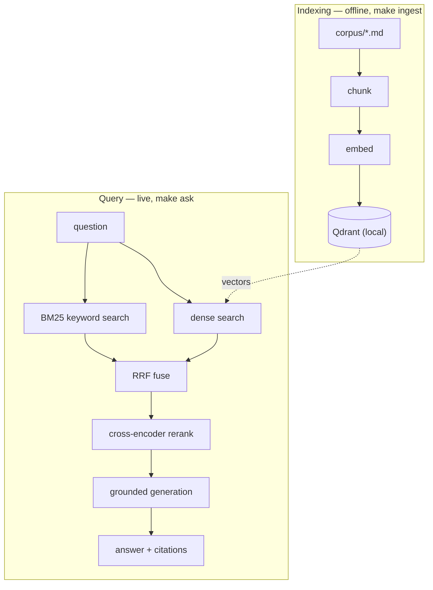

---
tags:
  - lab
  - apps-agents
  - rag
---
# Lab 02 · Production RAG

> [AI Engineering Studio](/) › [Labs](/labs/) · ⏱ ~2–3 hours · **Intermediate** · Cost: **$0**

You'll build a RAG system that goes past "chat with a PDF" toward what production
actually looks like: **hybrid retrieval** (dense + keyword), **rank fusion**, a
**cross-encoder reranker**, **grounded answers with citations**, and a **small
evaluation gate**. It's provider-agnostic — local Ollama by default, or a hosted tier
([Choosing a Model Backend](/labs/model-backends)). Embeddings default to local
Ollama even if your chat model is hosted.

> **Three-layer reading model.** The numbered steps are the main track — completable
> without prior AI knowledge. **Context** boxes add the SE framing; **go-deeper**
> pointers link the engineering detail; the close shows how you'd explain it to a
> customer.

## What you build

| Part | File | What it teaches |
| --- | --- | --- |
| Indexing | `ingest.py` | Chunk documents, embed them, store vectors in Qdrant |
| Retrieval + answer | `rag.py` | Hybrid search → RRF → rerank → grounded generation |
| Evaluation | `evaluate.py` | A lightweight groundedness/correctness gate |

## Architecture



Everything runs locally and free: Qdrant in embedded mode (no server, no Docker),
embeddings via local Ollama, generation via your chosen backend.

<div class="ai-context">
  <div class="ai-label">What an SE says about this</div>
  <p>"RAG quality lives or dies in retrieval, not the model. Hybrid search plus a
  reranker is the cheapest, highest-leverage quality win — to a customer it's 'we
  search your docs two ways and double-check the results before the AI reads them.'"</p>
</div>

## Prerequisites

- **Python 3.10+** and `pip`.
- A **chat backend** and an **embedding backend** — see [Choosing a Model Backend](/labs/model-backends). Local default: Ollama with `llama3.1:8b` (chat) and `nomic-embed-text` (embeddings, `ollama pull nomic-embed-text`). Hosted chat (Groq) is fine; keep embeddings on Ollama or OpenAI (Groq has no embeddings).
- Completing [Lab 01](/labs/01-first-llm-app/) first is recommended.

## Quick Start

```bash
cd labs/02-production-rag
make setup        # install deps (openai, qdrant-client, rank-bm25, fastembed, dotenv)
make env          # create .env; defaults to local Ollama for chat + embeddings
make ingest       # build the index from corpus/  (run once)
make ask Q="what is reranking and why only rerank the top candidates?"
make eval         # run the groundedness gate over eval/qa.json
```

## Detailed Setup

### Step 1 · Ingest — chunk, embed, store

`make ingest` reads `corpus/*.md`, splits each doc into ~600-character chunks with
overlap, embeds every chunk, and stores the vectors + text in a local Qdrant
collection. Re-run it whenever the documents change.

Open `ingest.py` and look at `chunk()`. Chunk size is the most underrated decision in
RAG: too big buries the answer in noise, too small severs the context that makes a
sentence meaningful.

<div class="ai-context">
  <div class="ai-label">What an SE says about this</div>
  <p>"This offline step quietly sets the ceiling. If parsing or chunking mangles the
  source, no downstream cleverness recovers it — which is why 'just point it at our
  docs' is never quite that simple."</p>
</div>

### Step 2 · Hybrid retrieval + RRF

`rag.py` retrieves with **two** methods and fuses them. Dense (vector) search matches
on meaning; BM25 matches on exact keywords, names, and codes that vectors miss.
**Reciprocal Rank Fusion** combines the two ranked lists, scoring each document by the
sum of `1 / (k + rank)`.

<div class="ai-deeper">
  <span class="ai-label">Go deeper</span>
  Why hybrid beats vector-only, and the full retrieve → rerank → top-5 shape, is in
  the <code>rag-two-loops</code> visual and the
  <a href="/decision-frames/rag-tco">RAG cost frame</a>. RRF's <code>k</code> (here
  60) damps how much top ranks dominate.
</div>

### Step 3 · Rerank

The fused top candidates go through a **cross-encoder reranker** (`fastembed`, ONNX —
fast on CPU, no PyTorch), which re-scores each passage against the query and keeps the
best five. This is the cheapest quality win in RAG; you rerank only the top candidates
because cross-encoders are slow per pair. The reranker model downloads automatically
on first run; if it's unavailable the pipeline falls back to the fused order.

### Step 4 · Grounded generation

The top passages are assembled into a prompt with a system instruction to **answer
only from the context, cite sources, and say "I don't know" otherwise**. That's what
makes the answer trustworthy and traceable rather than a confident guess.

<div class="ai-context">
  <div class="ai-label">What an SE says about this</div>
  <p>"Grounding is the answer to 'how do we know it won't make things up?' — the model
  is constrained to your approved passages, with citations you can click."</p>
</div>

### Step 5 · Evaluate

`make eval` runs each question in `eval/qa.json` through the pipeline and uses the
model as a judge to score whether the answer matches the reference — including
correctly **declining** the off-topic question. It prints a pass rate.

<div class="ai-deeper">
  <span class="ai-label">Go deeper</span>
  This is the minimal version. A real eval harness — LLM-as-judge calibration plus a
  regression gate in CI — is Lab 04. The "what bar is good enough?" conversation is in
  the <a href="/poc-playbooks/scoping-an-ai-poc">POC playbook</a>.
</div>

## Project Structure

```
labs/02-production-rag/
├── README.md          # this file
├── Makefile           # env, setup, ingest, ask, eval, clean
├── requirements.txt   # openai, qdrant-client, rank-bm25, fastembed, dotenv
├── .env.example       # chat + embedding backend config
├── provider.py        # chat + embedding clients (provider-agnostic)
├── store.py           # local embedded Qdrant
├── ingest.py          # Step 1 — chunk, embed, store
├── rag.py             # Steps 2–4 — hybrid retrieve, rerank, generate
├── evaluate.py        # Step 5 — groundedness gate
├── corpus/            # sample documents to index
└── eval/qa.json       # evaluation questions + references
```

## Troubleshooting

| Symptom | Likely cause | Fix |
| --- | --- | --- |
| `connection refused` | Ollama not running | Start Ollama, or switch chat/embeddings to a hosted backend in `.env` |
| Embedding error / 404 model | Embedding model missing | `ollama pull nomic-embed-text` (or set `EMBED_BACKEND=openai`) |
| `Storage folder .qdrant is already accessed` | `ingest` and `ask` can't share the embedded DB at once | Run them one at a time (don't leave one running) |
| Reranker download fails | Offline / HF rate limit | The pipeline falls back to fused order; rerun later for reranking |
| Answers miss obvious facts | Chunking or `TOP_K` too small | Tune `CHUNK_CHARS` in `ingest.py`, raise `TOP_K` in `rag.py` |

## Cleanup

```bash
make clean   # remove the local .qdrant index and Python caches
```

## Cost

**$0–negligible.** Qdrant is embedded and free; local Ollama is free; the reranker is
a small local ONNX model. A hosted chat tier (Groq free / OpenAI pennies) is optional.

<div class="ai-explain">
  <div class="ai-label">Explain it to a customer</div>
  <p>"We built a system that searches your documents two ways — by meaning and by exact
  keywords — double-checks the best results, and then answers only from those passages
  with citations you can click. When the answer isn't in your documents, it says so
  instead of guessing. And we can measure how often it stays grounded, so 'is it good
  enough?' becomes a number you sign off on, not a gut call."</p>
</div>

## Next steps

- [Explaining a Hallucination](/talk-tracks/explaining-a-hallucination) — the talk track this lab's grounding backs up
- [The Real Cost of a RAG System](/decision-frames/rag-tco) — what this costs beyond the demo
- **Lab 03 · Agent System** (`labs/03-agent-system`, Phase 2) — let the model orchestrate tools, with RAG as one of them
