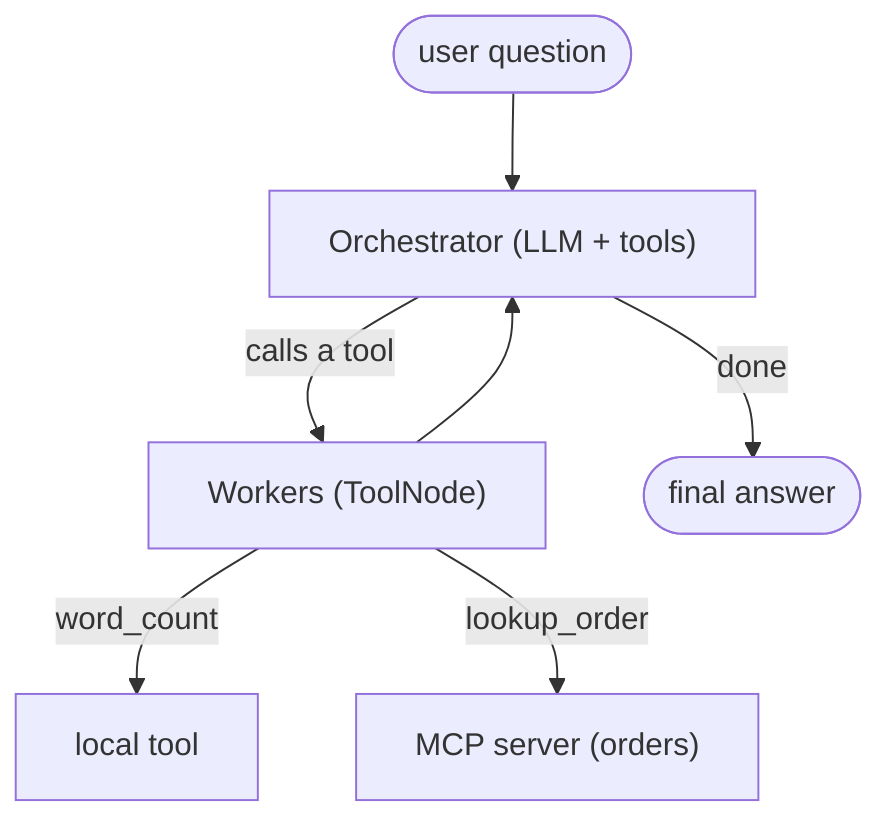

---
tags:
  - lab
  - apps-agents
  - agents
---
# Lab 03 · Agent System

> [AI Engineering Studio](/) › [Labs](/labs/) · ⏱ ~2–3 hours · **Intermediate** · Cost: **$0**

You'll build an **agent** — an LLM that decides its own next steps and calls tools to
get things done — using the production-default **hub-and-spoke orchestrator-worker**
pattern in [LangGraph](/foundations/langgraph-how-to), with one tool reached over
**MCP** (Model Context Protocol). Provider-agnostic; local Ollama by default (see
[Choosing a Model Backend](/labs/model-backends)).

> **Three-layer reading model.** The steps are the main track. **Context** boxes add
> SE framing; **go-deeper** pointers link the detail; the close is how you'd explain
> it to a customer.

> **Use a capable model.** Agents lean on the model's tool-routing. `llama3.1:8b` or a
> hosted model routes reliably; very small models (3B) are hit-or-miss.

## What you build

| Part | File | What it teaches |
| --- | --- | --- |
| MCP tool server | `mcp_server.py` | Exposing a system to an agent over MCP |
| The agent | `agent.py` | A hub-and-spoke graph: orchestrator routes to worker tools |
| MCP check | `mcp_check.py` | Verifying MCP wiring with no LLM |

## Architecture



The **orchestrator** decides, each turn, whether to answer or call a worker. The
**workers** are the tools — one local Python tool and one reached over MCP. Results
return to the orchestrator, which decides what to do next. That loop is the
hub-and-spoke pattern.

<div class="ai-context">
  <div class="ai-label">What an SE says about this</div>
  <p>"The orchestrator — how the request is broken into steps — is the single biggest
  reliability decision in an agent. When a customer asks 'how reliable is the agent?',
  they're really asking about the orchestrator, not the model."</p>
</div>

## Prerequisites

- **Python 3.10+** and `pip`.
- A **chat backend** — see [Choosing a Model Backend](/labs/model-backends). Prefer a capable model (`llama3.1:8b` local, or a hosted tier). Function calling must work (Llama 3.1+, Qwen 2.5, any Groq/OpenAI model).
- [Lab 01](/labs/01-first-llm-app/) (function calling) recommended first.

## Quick Start

```bash
cd labs/03-agent-system
make setup        # install deps (langgraph, langchain-openai, langchain-mcp-adapters, mcp, dotenv)
make env          # create .env (defaults to local Ollama)
make mcp-check    # confirm the MCP server exposes its tool (no LLM needed)
make run Q="What is the status of order A100?"
```

## Detailed Setup

### Step 1 · The MCP tool

Open `mcp_server.py`. It's a tiny MCP server exposing one tool, `lookup_order`. In
the real world that tool body would query your order database or API — the agent
never touches that system directly, it goes through the MCP server. Confirm it works
with `make mcp-check` (lists the tool without involving an LLM).

<div class="ai-context">
  <div class="ai-label">What an SE says about this</div>
  <p>"MCP is how an agent safely reaches your internal systems — a uniform, auditable
  boundary. Your code decides what the tool exposes; the agent only gets to call it."</p>
</div>

### Step 2 · The orchestrator graph

Open `agent.py`. The graph has two nodes: an **orchestrator** (the model with tools
bound to it) and a **tools** node (the workers). A conditional edge sends the
orchestrator to the tools when it emits a tool call, then loops back. When the
orchestrator answers without a tool call, the graph ends.

<div class="ai-deeper">
  <span class="ai-label">Go deeper</span>
  This is the standard LangGraph tool-agent shape. Concepts (state, nodes, edges,
  hub-and-spoke) are in <a href="/foundations/langgraph-how-to">LangGraph in 10
  Minutes</a>; the tool loads over MCP via <code>langchain-mcp-adapters</code>, which
  launches the server and exposes its tools as LangChain tools.
</div>

### Step 3 · Run it and read the trace

`make run` prints the full message trace: the human question, the orchestrator's tool
call, the tool result, and the final grounded answer. Try a question that needs a
tool (`"status of order C300?"`) and one that doesn't (`"what is 2+2?"`) to watch the
orchestrator route differently.

<div class="ai-deeper">
  <span class="ai-label">Go deeper</span>
  Whether a task even needs an agent (vs. RAG or a fixed workflow) is the
  <a href="/decision-frames/do-we-need-an-agent">Do We Even Need an Agent?</a> frame —
  agents cost 3–10× more calls, so earn them.
</div>

## Project Structure

```
labs/03-agent-system/
├── README.md          # this file
├── Makefile           # env, setup, run, mcp-check, clean
├── requirements.txt   # langgraph, langchain-openai, langchain-mcp-adapters, mcp, dotenv
├── .env.example       # chat backend config
├── provider.py        # provider-agnostic LangChain chat model
├── mcp_server.py      # the MCP tool server (an 'orders' system)
├── agent.py           # the hub-and-spoke LangGraph agent
└── mcp_check.py       # list MCP tools (no LLM)
```

## Troubleshooting

| Symptom | Likely cause | Fix |
| --- | --- | --- |
| `connection refused` | Ollama not running | Start Ollama, or switch to a hosted backend in `.env` |
| Agent answers without calling the tool | Small model routing poorly | Use `llama3.1:8b` or a hosted model |
| `mcp-check` hangs or errors | MCP server didn't launch | Ensure deps installed; run `python mcp_server.py` alone (it should wait on stdio) |
| Loops or repeats tool calls | Weak model over-calling | Use a stronger model; lower temperature (already 0) |

## Cleanup

```bash
make clean   # remove Python caches
```

## Cost

**$0–negligible.** All deps are pure-Python (no PyTorch); local Ollama is free; the
MCP server is a local process. A hosted tier (Groq free / OpenAI pennies) is optional
and recommended if your local model routes unreliably.

<div class="ai-explain">
  <div class="ai-label">Explain it to a customer</div>
  <p>"We built an assistant that doesn't just answer — it decides what to do and calls
  your systems to do it, through a controlled, auditable connection (MCP). A
  coordinator breaks the request into steps and hands each to the right tool, then
  assembles the answer. The reliability lives in that coordinator, which is exactly
  what we design and test — and we only reach for an agent when the task genuinely
  needs it."</p>
</div>

## Next steps

- [Do We Even Need an Agent?](/decision-frames/do-we-need-an-agent) — when this is overkill
- [LangGraph in 10 Minutes](/foundations/langgraph-how-to) · [ADR 001](/decisions/001-langgraph-orchestration) — the orchestration standard
- **Lab 04 · Eval Harness** (Phase 3) — measure and gate agent/RAG quality in CI
