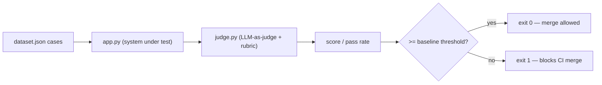

---
tags:
  - lab
  - apps-agents
  - evals
---
# Lab 04 · Eval Harness

> [AI Engineering Studio](/) › [Labs](/labs/) · ⏱ ~2 hours · **Intermediate** · Cost: **$0**

A demo that "kind of works" takes an afternoon; a system you *trust* takes a way to
measure it. You'll build an **eval harness** — a dataset, an **LLM-as-judge**, and a
**regression gate** that exits non-zero (so it can block a CI merge). This is the
practice that most separates production AI from demos. Provider-agnostic (see
[Choosing a Model Backend](/labs/model-backends)).

> **Three-layer reading model.** Steps are the main track; **context** boxes add SE
> framing; **go-deeper** pointers link the detail; the close is the customer version.

## What you build

| Part | File | What it teaches |
| --- | --- | --- |
| System under test | `app.py` | A small assistant to grade (stands in for your RAG/agent) |
| Dataset | `dataset.json` | Cases with per-case criteria, including must-decline cases |
| Judge | `judge.py` | LLM-as-judge with a rubric + calibration techniques |
| Gate | `run_eval.py` + `baseline.json` | Pass-rate threshold that fails the build on regression |

## Architecture



<div class="ai-context">
  <div class="ai-label">What an SE says about this</div>
  <p>"This is the answer to 'how do we know it's good enough?' — not a gut call after
  a demo, but a number on an agreed test set. When the number drops, the build fails,
  before users notice."</p>
</div>

## Prerequisites

- **Python 3.10+** and `pip`.
- A **chat backend** — see [Choosing a Model Backend](/labs/model-backends). Optionally a **stronger judge model** (`JUDGE_MODEL` in `.env`) for more reliable grading.
- [Lab 02](/labs/02-production-rag/) recommended (it has a lightweight eval this lab formalizes).

## Quick Start

```bash
cd labs/04-eval-harness
make setup        # install deps (openai, dotenv)
make env          # create .env (defaults to local Ollama)
make eval         # run the harness + gate
```

## Detailed Setup

### Step 1 · The dataset and the system under test

`dataset.json` holds cases, each with an `input` and **`criteria`** — what a correct
answer must do. Good eval sets come from *real* traffic, not invented examples, and
include the hard cases: ambiguous questions and ones the system should **decline**.
`app.py` is the thing being graded (here a support assistant; in your project, your
RAG pipeline or agent).

<div class="ai-context">
  <div class="ai-label">What an SE says about this</div>
  <p>"The test set is the contract. We build it *with* the customer, from their real
  questions, and agree the bar before building — so 'good enough' is decided up front,
  not argued about on demo day."</p>
</div>

### Step 2 · LLM-as-judge (and why to calibrate it)

`judge.py` uses a model to grade each answer against its criteria. The catch: the
judge is an LLM too, so it can be wrong the same ways the system under test is. Three
techniques reduce that noise:

1. **A strict rubric** — grade against explicit criteria, not vibes.
2. **A structured verdict** — `VERDICT: PASS/FAIL` + a one-line reason, easy to parse.
3. **A stronger judge model** — set `JUDGE_MODEL` to a bigger model than the SUT.

<div class="ai-deeper">
  <span class="ai-label">Go deeper</span>
  Even calibrated, an LLM judge is an approximation — spot-check it against a handful
  of human labels before trusting it as a gate. Small models make especially noisy
  judges (why the <a href="/labs/02-production-rag/">Lab 02</a> eval was flaky).
</div>

### Step 3 · The gate

`run_eval.py` computes the pass rate and compares it to the threshold in
`baseline.json`. Below the bar, it **exits non-zero** — and a non-zero exit fails a CI
check, which blocks the merge. `eval-ci.example.yml` is a ready-to-copy GitHub Actions
workflow (gate on a hosted model via secrets — CI runners have no local GPU).

<div class="ai-deeper">
  <span class="ai-label">Go deeper</span>
  This gate is a simple threshold. A fuller <em>regression</em> gate saves per-case
  results as a baseline and fails when specific cases newly break — catching "prompt
  drift" from a provider model update. Same exit-code mechanism.
</div>

### What a real run shows

Run against a small local model, the harness catches genuine problems — for example,
an answer that dodges the actual question, and a **prompt-injection** case where the
assistant is tricked into going off-scope. Those fail the judge, the pass rate drops
below the bar, and the gate fails. That's not the lab breaking — that's the eval doing
exactly its job. A stronger/hardened system clears the bar.

## Project Structure

```
labs/04-eval-harness/
├── README.md            # this file
├── Makefile             # env, setup, eval, clean
├── requirements.txt     # openai, dotenv
├── .env.example         # SUT + optional stronger-judge config
├── provider.py          # SUT client + judge client (provider-agnostic)
├── app.py               # the system under test
├── dataset.json         # eval cases with criteria
├── judge.py             # LLM-as-judge (rubric + structured verdict)
├── run_eval.py          # harness + gate (exit code)
├── baseline.json        # the agreed pass-rate threshold
└── eval-ci.example.yml  # sample CI workflow (copy to .github/workflows/)
```

## Troubleshooting

| Symptom | Likely cause | Fix |
| --- | --- | --- |
| `connection refused` | Ollama not running | Start Ollama, or use a hosted backend in `.env` |
| Judge verdicts seem random | Small/weak judge model | Set `JUDGE_MODEL` to a stronger model |
| Everything fails | SUT backend/model misconfigured | Check `.env`; try the case inputs in Lab 01 first |
| Gate never fails | Threshold too low | Raise `pass_rate_threshold` in `baseline.json` |

## Cleanup

```bash
make clean   # remove Python caches
```

## Cost

**$0–negligible.** Local Ollama is free; a hosted judge (Groq free / OpenAI pennies)
is optional and improves grading reliability.

<div class="ai-explain">
  <div class="ai-label">Explain it to a customer</div>
  <p>"We don't ask you to trust the AI on faith — we measure it. We built a scorecard
  from real questions, with an agreed pass mark, and a second AI grades every answer
  against clear criteria. If quality drops below the bar, the system refuses to ship
  the change automatically. 'Is it good enough?' becomes a number you signed off on,
  not a gut call after a demo."</p>
</div>

## Next steps

- [Scoping an AI POC](/poc-playbooks/scoping-an-ai-poc) — where the test set and bar get agreed
- [Explaining a Hallucination](/talk-tracks/explaining-a-hallucination) — the failures evals catch
- **Lab 05 · Serving & Cost** (Phase 3) — measure latency and cost tradeoffs
