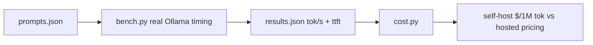

---
tags:
  - lab
  - llmops-infra
  - cost
---
# Lab 05 · Serving & Cost

> [AI Engineering Studio](/) › [Labs](/labs/) · ⏱ ~1.5 hours · **Advanced** · Cost: **$0**

"How much will this cost?" gets answered with a guess more often than a measurement.
This lab measures instead: you'll benchmark the **same model at two quantization
levels** on your own machine — real tokens/sec, real time-to-first-token — then turn
that into a **self-host vs hosted-API** cost comparison using published pricing.
Provider-agnostic in spirit, but this one is deliberately local — you're measuring
*your* hardware, not a hosted number someone else measured on theirs.

> **Three-layer reading model.** Steps are the main track; **context** boxes add SE
> framing; **go-deeper** pointers link the detail; the close is the customer version.

## What you build

| Part | File | What it teaches |
| --- | --- | --- |
| Benchmark | `bench.py` | Real tokens/sec + time-to-first-token per model, from Ollama's own timing |
| Prompt set | `prompts.json` | A short/medium/long mix — quantization loss shows up differently by task |
| Cost model | `cost.py` | Measured throughput → \$/1M tokens self-host, compared to published hosted pricing |

## Architecture



<div class="ai-context">
  <div class="ai-label">What an SE says about this</div>
  <p>"Quantization is how you fit a bigger model on smaller hardware — it shrinks the
  model's weights to lower precision. The tradeoff is real but usually smaller than
  people assume for an 8B-class model doing everyday tasks. This is the demo that
  turns 'quantization loses quality' from a claim into a number you both watched
  happen."</p>
</div>

## Prerequisites

- **[Ollama](https://ollama.com)** installed and running (`ollama --version`). This
  lab benchmarks local serving directly — no hosted backend option, that's the point.
- **~8 GB free disk** — you'll pull the same model at two precisions.
- Python 3.9+ and `pip`. See [Before you start](/labs/#before-you-start) for the
  one-time venv setup.

> ⚠️ **This lab assumes Apple Silicon.** Every other lab in this series falls back
> to a free hosted backend on Intel/older hardware, but Lab 05 is deliberately
> local-only — it's measuring *your* serving hardware, not a hosted number. On an
> Intel Mac (no GPU, CPU-only inference), expect the fp16 variant to be **painfully
> slow** — tens of seconds per response, not the sub-second feel of a hosted model.
> That's not a bug: it's the tradeoff this lab exists to make visible. If it feels
> unusable, cut `RUNS` to `1` in `.env`, or read the [real run below](#what-a-real-run-shows)
> (measured on an Intel i9, CPU-only) instead of running it yourself.

## Quick Start

```bash
cd labs/05-serving-and-cost
make setup        # install deps (requests, dotenv)
make env          # create .env (defaults to comparing llama3.2:3b at two precisions)
make pull         # download both model variants (~8 GB total, one-time)
make bench        # measure real tokens/sec + time-to-first-token
make report        # turn the measurement into a cost comparison
```

## Detailed Setup

### Step 1 · What "quantization" actually changes

A model's weights are normally stored as 16-bit floats (`fp16`). Quantization rounds
those weights to lower precision — commonly 4-bit (`q4`) — to cut memory and disk
size roughly in half or more, and speed up inference, at some cost to output quality.
`llama3.2:3b` on Ollama defaults to a `q4_K_M` quantization; `llama3.2:3b-instruct-fp16`
is the same model at full precision. Same weights, same architecture, different
precision — which isolates the quantization effect from a model-size effect.

<div class="ai-context">
  <div class="ai-label">What an SE says about this</div>
  <p>"'Quantized' sounds like a compromise, but it's the industry default — almost
  nobody serves models at full precision in production, because the speed and cost
  win is large and the quality loss is usually small for everyday tasks. This lab
  shows you both sides of that trade on your own hardware instead of taking it on
  faith."</p>
</div>

<div class="ai-deeper">
  <span class="ai-label">Go deeper</span>
  Quantization schemes vary (q4_K_M, q5_K_M, q8_0, and others) trading size/speed
  against quality along a curve — `q4_K_M` isn't the only option, just Ollama's
  practical default for this model size. Production serving stacks like
  <strong>vLLM</strong> or <strong>SGLang</strong> (this site's canonical cast for
  production serving) add continuous batching and paged attention on top of
  quantization — the throughput gain per dollar at real concurrency is larger than
  anything a single-stream local benchmark like this one can show.
</div>

### Step 2 · Benchmark real throughput and latency

`make bench` runs `bench.py`: each model answers the same three prompts (short
factual, medium reasoning, longer summary) a few times each, and Ollama's own
response metadata — `eval_count`, `eval_duration`, `prompt_eval_duration` — gives
exact tokens/sec and an approximate time-to-first-token. No manual stopwatch, no
guessing: these numbers come straight from the server.

<div class="ai-deeper">
  <span class="ai-label">Go deeper</span>
  The first call to a model pays a one-time "load into memory" cost
  (`load_duration`) that later calls skip as long as Ollama keeps it warm — that's
  folded into the time-to-first-token average here, which is why the first prompt's
  numbers run a little high. In a production server this cold-start cost is paid
  once at startup, not per request.
</div>

### Step 3 · Turn throughput into a cost comparison

`make report` runs `cost.py`: it takes the tokens/sec you actually measured, assumes
a GPU/instance hourly rate (`GPU_HOURLY_USD` in `.env`, illustrative — set it to
what you'd actually pay), and computes \$ per 1M output tokens for a single
continuous stream on your hardware. It prints that next to published hosted-API
pricing (Groq, OpenAI — checked 2026-07-03, re-verify before quoting a customer)
so you can see where the crossover actually sits.

<div class="ai-context">
  <div class="ai-label">What an SE says about this</div>
  <p>"A single unbatched stream is the worst case for self-hosting — real production
  serving batches many requests onto the same GPU, which is what makes self-host
  economics work at volume. This number is a floor, not a forecast. The full
  answer is the <a href="/decision-frames/frame-cost-at-scale">cost-at-scale
  decision frame</a>."</p>
</div>

## What a real run shows

A real run on an **Intel i9 Mac, CPU-only (no GPU)** — the worst case this lab
warns about above. Apple Silicon or a real GPU will be meaningfully faster; the
*shape* of the result (quantization wins on speed, single-stream self-host loses
on cost) holds regardless of hardware:

| Model | tok/s | Time-to-first-token |
| --- | --- | --- |
| `llama3.2:3b` (q4_K_M, default) | ~7.1 | ~1.7s |
| `llama3.2:3b-instruct-fp16` (full precision) | ~1.5 | ~7.0s |

Quantization made this model **~4.7× faster** on identical hardware, for the same
weights. That's the real, measured tradeoff — on everyday tasks like these three
prompts, the speed win is large and obvious; whether the *quality* loss matters
depends on the task (see the go-deeper note on evaluating it with
[Lab 04](/labs/04-eval-harness/)).

The cost report is the more surprising number:

```
model                                 tok/s   $/1M output tok (self-host)
llama3.2:3b                             7.1                       19.55
llama3.2:3b-instruct-fp16               1.5                       94.25

Hosted tier                          $/1M input    $/1M output
Groq — Llama 3.1 8B Instant                0.05           0.08
```

At a single unbatched stream, self-hosting this small model is **over 200× more
expensive per token** than the cheapest hosted tier — not cheaper, as intuition
might suggest for "running it yourself." That's not an argument against
self-hosting; it's the lab doing its job: a single-stream local benchmark is the
worst case for self-host economics, and the honest number says so. Real production
self-hosting wins by batching many concurrent requests onto the same hardware —
see [What Will This Cost at Scale?](/decision-frames/frame-cost-at-scale) for why
that changes the picture, and by how much.

## Project Structure

```
labs/05-serving-and-cost/
├── README.md            # this file
├── Makefile              # env, setup, pull, bench, report, clean
├── requirements.txt      # requests, dotenv
├── .env.example          # models to compare + illustrative GPU $/hr
├── prompts.json           # the short/medium/long prompt mix
├── bench.py               # real Ollama timing → results.json
└── cost.py                # results.json → self-host vs hosted cost table
```

## Troubleshooting

| Symptom | Likely cause | Fix |
| --- | --- | --- |
| `connection refused` | Ollama not running | `ollama serve`, or open the Ollama app |
| `model not found` | Haven't pulled it yet | `make pull` |
| Numbers look identical between models | Ollama still has the other model loaded/cached oddly | Re-run `make bench`; check `ollama ps` shows the model you expect |
| `tok/s` seems low vs. what you've seen elsewhere | CPU-only inference (no GPU — common on Intel Macs), or another heavy process running | Expected on Intel/CPU-only hardware, see the prerequisites note above; on Apple Silicon, close other apps and confirm you're not on a low-power mode |
| fp16 model feels stuck / takes 10s+ per response | Full-precision inference on CPU-only hardware — this is real, not a hang | Expected on Intel; let it finish, lower `RUNS` to `1`, or just read the real-run numbers below instead |

## Cleanup

```bash
make clean          # remove results.json and Python caches
ollama rm llama3.2:3b-instruct-fp16   # optional: free ~6 GB
```

## Cost

**$0.** Ollama and both model variants run entirely locally — the only cost is disk
space and the electricity to run your laptop. The dollar figures this lab produces
are a *model* of hosted/self-host cost, not a bill.

<div class="ai-explain">
  <div class="ai-label">Explain it to a customer</div>
  <p>"Before we recommend running your own model versus calling a hosted one, we
  measure it — on real hardware, with your kind of workload, not a vendor's
  benchmark slide. That's what tells us whether self-hosting actually saves you
  money at your volume, or whether it's a cost and a headache you don't need yet."</p>
</div>

## Next steps

- [What Will This Cost at Scale?](/decision-frames/frame-cost-at-scale) — turns this lab's numbers into the volume/break-even conversation
- [Managed API vs Self-Host](/decision-frames/managed-vs-self-host) — the build-vs-buy frame this lab feeds numbers into
- [Lab 06 · Observability](/labs/06-observability/) — trace and dashboard the cost you just modeled
