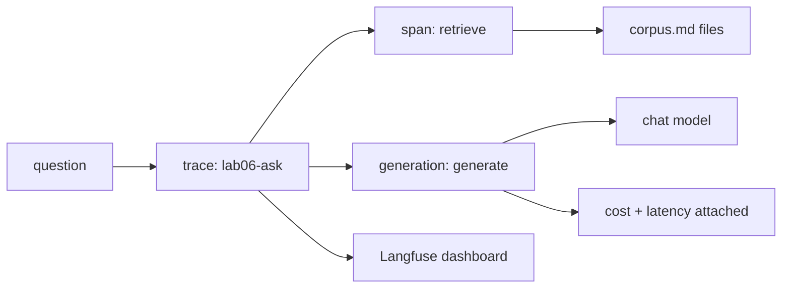

---
tags:
  - lab
  - llmops-infra
  - observability
---
# Lab 06 · Observability

> [AI Engineering Studio](/) › [Labs](/labs/) · ⏱ ~1 hour · **Intermediate** · Cost: **$0**

A demo that worked once isn't the same as a system you can debug in production.
This lab instruments a small RAG app with **Langfuse** so every question produces a
**trace** — nested spans for retrieval and generation, with latency and cost
attached — instead of a black box that either "worked" or "didn't." Provider-agnostic
chat and embeddings (see [Choosing a Model Backend](/labs/model-backends)); Langfuse
runs on its free hosted tier, so this stays $0.

> **Three-layer reading model.** Steps are the main track; **context** boxes add SE
> framing; **go-deeper** pointers link the detail; the close is the customer version.

## What you build

| Part | File | What it teaches |
| --- | --- | --- |
| Retrieval | `retrieve.py` | A minimal embedding search over a tiny corpus — deliberately simple, this lab is about observing, not optimizing, retrieval |
| Traced app | `app.py` | Two nested Langfuse spans per question (retrieve, generate) under one trace, with cost + latency attached |
| Corpus | `corpus/` | Three short docs about tracing, cost/latency, and dashboards — the app answers questions about its own topic |

## Architecture



<div class="ai-context">
  <div class="ai-label">What an SE says about this</div>
  <p>"This is the answer to 'how do we know what's happening in production?' —
  not server logs you grep through after a complaint, but a per-request trace
  that shows exactly which step (retrieval or generation) produced a bad
  answer, plus a trend line so a regression is visible before a customer
  reports it."</p>
</div>

## Prerequisites

- A **chat + embedding backend** — see [Choosing a Model Backend](/labs/model-backends). Embeddings default to local Ollama (Groq is chat-only).
- A **free [Langfuse Cloud](https://cloud.langfuse.com) account** — sign up, create a project, copy the two API keys. The app still runs without them (see Troubleshooting), you just won't see a dashboard.
- [Lab 02](/labs/02-production-rag/) recommended first (this lab's retrieval is a deliberately smaller version of that one).

## Quick Start

> First time in the labs? Do the [one-time setup](/labs/#before-you-start) — a Python virtualenv, and picking a model backend — then come back here.

```bash
cd labs/06-observability
make setup        # install deps (openai, dotenv, langfuse)
make env          # create .env (defaults to local Ollama; add Langfuse keys to see traces)
make pull         # (Ollama only) download the chat + embedding models
make ask Q="why do traces matter?"
```

## Detailed Setup

### Step 1 · A trace with two nested spans

`app.py`'s `ask()` opens one **trace** (`lab06-ask`), then opens two **child
spans** inside it: a `retriever` span around `retrieve.py`'s corpus search, and a
`generation` span around the chat call. Langfuse groups them visually as one
request with two timed steps — the same "retrieval vs. generation" boundary this
site's RAG lessons keep coming back to.

<div class="ai-context">
  <div class="ai-label">What an SE says about this</div>
  <p>"When a customer asks 'why did it say that,' this is the difference between
  guessing and knowing — you open the trace, see whether retrieval returned the
  wrong passage or generation ignored the right one, and you have your answer in
  seconds instead of trying to reproduce the bug."</p>
</div>

### Step 2 · Attaching cost and latency

The `generation` span records `usage_details` (input/output token counts from the
provider's response) and `cost_details` (computed the same way as
[Lab 05's cost.py](/labs/05-serving-and-cost/) — $0 for local Ollama, an
illustrative published rate for hosted backends), plus latency in the metadata.
That's what turns a trace viewer into a cost and performance dashboard, not just a
debugger.

<div class="ai-deeper">
  <span class="ai-label">Go deeper</span>
  Langfuse's Python SDK is built on OpenTelemetry — <code>start_as_current_observation</code>
  is a context manager that opens a span/generation and closes it automatically,
  which is why nesting reads as plain Python <code>with</code> blocks instead of
  manual parent/child bookkeeping.
</div>

### Step 3 · What happens without Langfuse configured

The app is designed to keep working even if you skip the Langfuse signup: the SDK
disables itself gracefully with no public key, and only logs a warning (not a
crash) if the keys are set but wrong. `app.py` catches the one case that isn't
automatically graceful — asking a disabled client for a trace URL — so the chat
always answers; you only lose the dashboard link.

<div class="ai-deeper">
  <span class="ai-label">Go deeper</span>
  This matters beyond this lab: instrumentation code should never be able to take
  down the feature it's observing. A tracing library that throws on a network
  hiccup or a bad API key is a liability in production, not an observability win.
</div>

## What a real run shows

A real run against local Ollama (`llama3.2`, embeddings via `nomic-embed-text`),
tested in all three states:

| Langfuse state | Result |
| --- | --- |
| No keys set | App answers correctly; prints "Trace: not available (set LANGFUSE_PUBLIC_KEY/SECRET_KEY...)" |
| Keys set but invalid | Logs `Failed to export span batch code: 401, reason: Unauthorized` twice (once per span); app still answers correctly |
| Keys set and valid | App answers correctly; prints a real `https://cloud.langfuse.com/...` trace URL |

The question "Why do traces matter for LLM apps?" retrieved the `tracing.md` doc
and generated a grounded answer citing the same "succeeds but is wrong" distinction
that doc makes — retrieval and generation both did their job, and the trace would
show it.

## Project Structure

```
labs/06-observability/
├── README.md            # this file
├── Makefile              # env, setup, pull, ask, clean
├── requirements.txt      # openai, dotenv, langfuse
├── .env.example          # backend + Langfuse key config
├── provider.py            # chat + embedding client resolver (same pattern as Lab 02)
├── retrieve.py             # tiny in-memory embedding search
├── corpus/                 # tracing.md, cost-and-latency.md, dashboards.md
└── app.py                   # the traced ask() + CLI entry point
```

## Troubleshooting

| Symptom | Likely cause | Fix |
| --- | --- | --- |
| `connection refused` | Ollama not running | `ollama serve`, or use a hosted backend in `.env` |
| "Trace: not available" every time | No Langfuse keys in `.env` | Sign up at [cloud.langfuse.com](https://cloud.langfuse.com), add the two keys — or skip it, the chat still works |
| `Failed to export span batch code: 401` | Langfuse keys present but wrong | Re-check `LANGFUSE_PUBLIC_KEY`/`LANGFUSE_SECRET_KEY` against the project's API keys page |
| Answers ignore the corpus | Embedding backend misconfigured | Check `EMBED_BACKEND`/`EMBED_MODEL` in `.env`; confirm `nomic-embed-text` is pulled |

## Cleanup

```bash
make clean   # remove Python caches
```

## Cost

**$0.** Local Ollama is free; Langfuse's free tier covers this lab's traffic many
times over.

<div class="ai-explain">
  <div class="ai-label">Explain it to a customer</div>
  <p>"When something goes wrong in production, we don't want to guess or ask you
  to reproduce it. Every request leaves a trace — what was retrieved, what the
  model generated, how long each step took, what it cost — so we can open the
  exact request that failed and see precisely which step broke, in seconds."</p>
</div>

## Next steps

- [Lab 04 · Eval Harness](/labs/04-eval-harness/) — the pre-merge counterpart to this lab's live-traffic view
- [Lab 05 · Serving & Cost](/labs/05-serving-and-cost/) — the cost model this lab's `cost_details` reuses
- [Lab 07 · Capstone](/labs/07-capstone/) — the full RAG-agent app this lab's tracing pattern extends to
