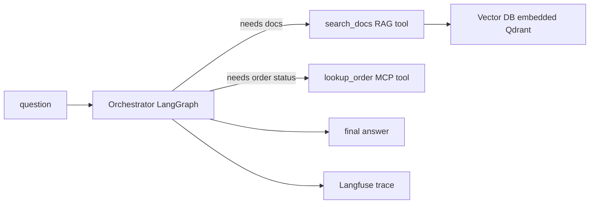

---
tags:
  - lab
  - capstone
---
# Lab 07 · Capstone

> [AI Engineering Studio](/) › [Labs](/labs/) · ⏱ ~4 hours · **Advanced** · Cost: **$0**

Every earlier lab built one layer. This one assembles them into a single support
assistant: a hub-and-spoke agent ([Lab 03](/labs/03-agent-system/)) that can search
product docs with hybrid retrieval + rerank ([Lab 02](/labs/02-production-rag/)) or
look up an order over MCP, with the whole run traced in
**Langfuse** (Phase 5). One coherent scenario — a returns/shipping support bot —
instead of four disconnected demos.

> **Three-layer reading model.** Steps are the main track; **context** boxes add SE
> framing; **go-deeper** pointers link the detail; the close is the customer version.

## What you build

| Part | File | What it teaches |
| --- | --- | --- |
| RAG tool | `rag_tool.py` | Lab 02's hybrid (BM25 + dense, RRF) + cross-encoder rerank, wrapped as an agent tool |
| Order-lookup tool | `mcp_server.py` | The same MCP "orders" server as Lab 03 — reused, not rebuilt |
| Orchestrator | `agent.py` | Hub-and-spoke LangGraph routing between both tools, one Langfuse trace per question |
| Corpus | `corpus/` | Shipping, returns, and product FAQ docs for one coherent support scenario |

## Architecture



<div class="ai-context">
  <div class="ai-label">What an SE says about this</div>
  <p>"This is the shape a real support-assistant engagement takes: one
  orchestrator, a retrieval tool for policy questions, a systems-integration
  tool (MCP) for anything that needs a live lookup, and a trace on every
  request so 'why did it say that' has an answer. Every piece here is a lab
  you can point to and say 'we built that, here's how it works.'"</p>
</div>

## Prerequisites

- A **chat backend that reliably calls tools** — this is the one place in the
  series where model capability really matters. `llama3.1:8b`+ locally, or any
  hosted model (Groq, OpenAI), route correctly; smaller local models (e.g.
  `llama3.2` 3B) frequently garble tool-call arguments — see Troubleshooting.
- **Python 3.10+** (the MCP adapter needs it, same as [Lab 03](/labs/03-agent-system/)).
- A **free [Langfuse Cloud](https://cloud.langfuse.com) account** — optional; the agent runs without it.
- Labs 02, 03, and 06 recommended first — this lab assembles their patterns rather than re-teaching them.

## Quick Start

> First time in the labs? Do the [one-time setup](/labs/#before-you-start) — a Python virtualenv, and picking a model backend — then come back here.

```bash
cd labs/07-capstone
make setup        # install deps (openai, qdrant-client, rank-bm25, fastembed, langgraph, mcp, langfuse, dotenv)
make env          # create .env (defaults to local Ollama)
make pull         # download the chat + embedding models
make ingest        # build the RAG index from corpus/
make run Q="what's your return policy, and what's the status of order A100?"
```

## Detailed Setup

### Step 1 · Two tools, one orchestrator

`agent.py` builds the same hub-and-spoke graph as Lab 03 — `START → orchestrator →
(needs a tool?) → tools → orchestrator → END` — with two spokes: `search_docs`
(the RAG tool) and `lookup_order` (the MCP tool). The orchestrator decides which
tool a question needs, or both, and composes the final answer from whatever it
gets back.

<div class="ai-context">
  <div class="ai-label">What an SE says about this</div>
  <p>"A customer asking about returns and their order status in the same message
  is normal, not an edge case. This is what 'agent' is actually for — routing
  one request across multiple systems and giving one coherent answer, instead of
  making the customer ask twice."</p>
</div>

### Step 2 · The RAG tool doesn't answer, it retrieves

`search_docs` returns cited passages as text — the same hybrid retrieval +
cross-encoder rerank pipeline as Lab 02 — but it does **not** generate a final
answer itself. The orchestrator does that, so one reply can cite a policy doc
*and* an order status together, instead of two disconnected tool answers glued
together.

<div class="ai-deeper">
  <span class="ai-label">Go deeper</span>
  This is a deliberate design choice, not the only valid one — some agent
  architectures have tools return a pre-formed answer. Returning raw, cited
  context and letting the orchestrator synthesize keeps the tool simple and
  lets the model combine sources; the tradeoff is the orchestrator now needs to
  be trusted to cite correctly, which is exactly what a stronger model buys you.
</div>

### Step 3 · One trace per question

The whole `agent.ainvoke()` call is wrapped in a single Langfuse trace (`capstone-ask`),
the same non-blocking pattern as **Lab 06** (Phase 5) — no Langfuse keys, no
crash, just no dashboard link.

<div class="ai-deeper">
  <span class="ai-label">Go deeper</span>
  This lab traces at the whole-agent level for simplicity. Lab 06 shows the
  finer-grained version — separate spans per retrieval and generation step — and
  that pattern extends here too: wrap the RAG tool's retrieve/rerank and the
  orchestrator's LLM call in their own nested spans if you need to debug which
  tool call was slow or wrong, not just that the agent as a whole was.
</div>

## Cloud Track (optional — not run by this repo)

The **local track above is the whole lab** and is what's been built and tested here.
A second track exists only as a documented option, per this site's rule to
**never force spend**: if you need higher throughput than a laptop CPU gives you,
`provider.py`'s `get_chat_model()` already honors `OPENAI_BASE_URL` as an
override, so pointing `MODEL_BACKEND=openai` at a rented-GPU serving endpoint
(vLLM/SGLang, per [Lab 05](/labs/05-serving-and-cost/)'s canonical cast) is a
one-line `.env` change, not a code change. No cloud resources are provisioned or
billed by following this lab — that step, if you take it, is yours to size and pay
for. See [What Will This Cost at Scale?](/decision-frames/frame-cost-at-scale)
before you do.

## What a real run shows

Tested end-to-end on real local Ollama, embedded Qdrant, and the real MCP order
server:

- **`llama3.2` (3B)** — the orchestrator's tool-call arguments came back malformed
  (e.g. passing the tool's own JSON schema as the argument value instead of a real
  query string), and it hallucinated a `lookup_order` call as raw text instead of
  invoking the tool. This is a model-capability limit, not a bug in the tools —
  matches this series' existing guidance (Lab 01, Lab 03) that reliable tool
  calling needs `llama3.1:8b`+.
- **`llama3.1:8b`** — routed correctly to both tools for a combined
  returns-policy-and-order-status question. The first pass called both tools
  correctly but the final answer only addressed the order status, silently
  dropping the return-policy content it had already retrieved — the orchestrator
  needed an explicit system prompt telling it to address every part of a
  multi-part question (now in `agent.py`'s `SYSTEM_PROMPT`) before it reliably
  composed one answer citing both.

## Project Structure

```
labs/07-capstone/
├── README.md            # this file
├── Makefile              # env, setup, pull, ingest, run, clean
├── requirements.txt      # openai, qdrant-client, rank-bm25, fastembed, langgraph, mcp, langfuse, dotenv
├── .env.example          # backend + Langfuse + optional cloud-track config
├── provider.py            # chat (LangChain) + embeddings (raw client), OPENAI_BASE_URL override
├── store.py                # embedded Qdrant (no server, no Docker)
├── ingest.py                # corpus/*.md -> vector index
├── corpus/                   # shipping-policy.md, returns-policy.md, product-faq.md
├── rag_tool.py                # hybrid retrieval + rerank, wrapped as an agent tool
├── mcp_server.py               # the "orders" MCP tool, reused from Lab 03
└── agent.py                     # hub-and-spoke orchestrator + Langfuse trace
```

## Troubleshooting

| Symptom | Likely cause | Fix |
| --- | --- | --- |
| Tool-call arguments come back malformed / garbled | Model isn't reliable at tool calling (common on small local models) | Use `llama3.1:8b`+ locally, or switch to a hosted backend (Groq/OpenAI) in `.env` |
| `connection refused` | Ollama not running | `ollama serve`, or use a hosted backend |
| Order lookup always says "not found" | Wrong order ID | Valid demo IDs are `A100`, `B200`, `C300` (see `mcp_server.py`) |
| RAG answers ignore the corpus | Forgot `make ingest`, or embedding backend misconfigured | Run `make ingest`; check `EMBED_BACKEND`/`EMBED_MODEL` in `.env` |

## Cleanup

```bash
make clean   # remove the local index and Python caches
```

## Cost

**$0** on the local track — Ollama, embedded Qdrant, and Langfuse's free tier
cover everything this lab does. The Cloud Track above is optional, undeployed by
default, and never runs without you explicitly provisioning and paying for it.

<div class="ai-explain">
  <div class="ai-label">Explain it to a customer</div>
  <p>"This is what we'd actually ship: one assistant that answers policy questions
  from your docs, checks a live order status when asked, and traces every request
  so we can debug a bad answer in minutes instead of trying to reproduce it. It's
  built from pieces we can each explain and test independently — nothing here is
  a black box."</p>
</div>

## Next steps

- [Reference Architectures](/lessons/architecture-governance/reference-architectures) — where this capstone sits on the pilot → platform spectrum
- [Lab 04 · Eval Harness](/labs/04-eval-harness/) — add a pass-rate gate on top of this agent before it ships
- **Learning Paths** (Phase 5) — role-based routes through the whole site, this lab included
