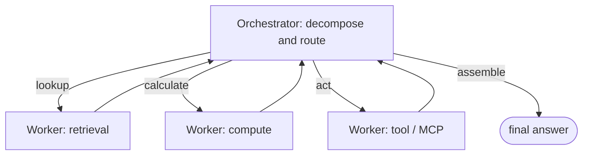

---
tags:
  - lesson
  - apps-agents
  - agents
  - customer-facing
---
# Agent Architectures

## 📝 Context

The agent conversation is full of hype about autonomous swarms of collaborating AIs.
Production reality is quieter and more reliable: the field has **decisively converged
on hub-and-spoke orchestrator-worker** systems, not peer-to-peer mesh. This lesson is
the architecture map — the patterns that exist, the one that dominates, and why.

> **Recommendation:** default to a single **orchestrator** routing to specialized
> **workers/tools**. The orchestrator's task decomposition is the #1 design decision.
> Treat mesh/swarm as research, not a production plan.

## 🎯 The Patterns

| Pattern | Shape | Reality |
| --- | --- | --- |
| **Single-agent tool use** | One LLM loop calling tools | The most common; handles most "agentic" needs |
| **Hub-and-spoke (orchestrator-worker)** | One orchestrator routes to specialized workers | **The production default for multi-step work** |
| **Mesh / swarm** | Many peer agents negotiating | Academically interesting; rare and hard to make reliable in production |

## 🧭 The Production Default

One coordinator decomposes the request, routes each sub-task to a specialized worker,
and assembles the result. It's debuggable (you can see which worker did what),
cheaper than a mesh, and its quality is dominated by one thing you control: the
orchestrator.

  
What an SE says about this

  
"When a customer asks 'how reliable is the agent?', they're really asking about
  the orchestrator — how well the request is broken into steps. Get that right and the
  workers are simple; get it wrong and no model quality saves you."

## 📊 The Cost Shape (illustrative)

Agentic patterns make **3–10× more LLM calls** than a single shot — every planning,
routing, and reflection step is more calls, more latency, and more failure surface.
More agents multiply this further, which is a large part of why mesh systems struggle
in production.

> **Accuracy note:** "3–10×" is a directional rule of thumb, not a measured constant —
> measure the real multiplier on your task before quoting cost.

## 🧩 Worked Scenario: "We Want a Team of Agents"

A customer wants five specialist agents that collaborate. You unpack it:

- **The real need** — answer support questions, check orders, and draft replies.
- **The right shape** — one orchestrator with three workers (retrieval, order-lookup, drafting), not five peers negotiating.
- **Why** — the peer version is harder to test, costs more, and fails in ways nobody can trace; the hub-and-spoke version does the same job and you can debug it.
- **The recommendation** — start with single-agent tool use; graduate to hub-and-spoke only where the task genuinely needs multi-step routing.

## 🚨 Failure Path

Building a mesh/swarm because it sounds cutting-edge: agents negotiating with agents,
no single point of control, failures that can't be traced to a step. It demos once
and falls over in production.

- **Symptom** — an agent system nobody can debug, with runaway cost and erratic behavior.
- **Root cause** — peer-to-peer autonomy where a coordinator was needed.
- **Fix** — collapse to hub-and-spoke: one orchestrator, specialized workers, clear control flow.

## 👁️ Audience Lens — Who Hears What

| | Engineer hears | Exec hears |
| --- | --- | --- |
| Hub-and-spoke | orchestrator + ToolNode, conditional edges | debuggable, predictable, controllable cost |
| Mesh / swarm | peer negotiation, emergent behavior | high risk, hard to test — avoid unless proven |

## 🗣️ Talk Track

  
Say it like this

  
"An agent system is really a flowchart the AI runs. The reliable production shape
  is a coordinator that breaks your request into steps and hands each to a specialist,
  then assembles the answer — not a swarm of AIs negotiating with each other. We put
  our engineering into that coordinator, because that's where reliability lives."

## ⚠️ Gotchas

- Confusing "multi-agent" with "better" — more agents multiply cost and failure surface.
- Under-investing in the orchestrator — it's the #1 reliability factor, not the model.
- Using an agent where RAG or a fixed workflow would do (see the decision frame).
- Weak models over-calling tools or looping — agents need a capable model to route well.

## 🔗 Links

- [Lab 03 · Agent System](/labs/03-agent-system/) — build hub-and-spoke hands-on
- [Do We Even Need an Agent?](/decision-frames/do-we-need-an-agent) — before you build one
- [LangGraph in 10 Minutes](/foundations/langgraph-how-to) · [ADR 001](/decisions/001-langgraph-orchestration)
- [MCP and A2A](/lessons/apps-agents/mcp-and-a2a) — how agents reach tools and each other
