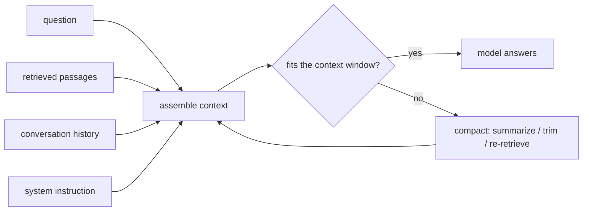

---
tags:
  - lesson
  - apps-agents
  - customer-facing
---
# Context Engineering

## 📝 Context

Everyone talks about prompt engineering — the wording of the instruction. The bigger
lever is usually **context engineering**: deciding *what information* goes into the
model's window, and *in what order*, for each request. RAG, chunking, memory, and
tool results are all context engineering. This lesson reframes "the prompt" as "the
briefing," because that's where most real quality lives.

> **Recommendation:** spend your effort on *what the model sees*, not just how you
> phrase the ask. The window is finite and its contents are the model's entire world
> for that call.

## 🎯 The Levers

| Lever | The decision | Why it matters |
| --- | --- | --- |
| **What to retrieve** | Which passages/tools/results to include | Wrong context → confident wrong answer |
| **How to chunk** | Passage size and boundaries | Sets the ceiling on what retrieval can even find |
| **Ordering** | Where in the window each piece sits | Models weight position; lead with the most relevant |
| **Compaction** | Summarize/trim old turns | The window is finite; overflow drops context silently |
| **Instruction** | System prompt: grounding, refusal, format | Turns raw capability into reliable behavior |

## 🧭 The Window Is Finite

  
What an SE says about this

  
"'It forgot what I told it' or 'it ignored the doc' is usually a context problem,
  not a model problem — the relevant thing wasn't in the window, or was buried. We fix
  it by engineering what goes in, not by swapping models."

## 📊 Rules of Thumb (illustrative)

- Chunk sizes commonly start around **300–800 tokens** with a small overlap — then
  tune by inspecting what retrieval returns. No universal best size.
- Lead with the **most relevant** passages; models weight earlier context more, and
  very long contexts dilute attention ("lost in the middle").

> **Accuracy note:** these ranges are *illustrative* starting points, not standards.
> The durable rule: measure retrieval quality on your own data and adjust.

## 🧩 Worked Scenario: The Long Conversation That Drifts

A support chat works well for five turns, then starts contradicting itself. The
window filled up; the earliest (and a key) turn scrolled out of context.

- **Diagnosis** — history grew past the window; old context was silently dropped.
- **Fix** — compaction: summarize older turns into a running brief, keep the summary + recent turns in the window.
- **Also** — re-retrieve relevant docs each turn rather than assuming they're still in context.
- **Result** — coherent long conversations without a bigger model.

## 🚨 Failure Path

Treating the context window as infinite — pasting entire documents or unbounded
history into every call. It's slow, expensive, dilutes attention, and silently drops
whatever doesn't fit.

- **Symptom** — degrading quality as conversations or documents grow; rising cost per call.
- **Root cause** — no strategy for what to include and what to compact.
- **Fix** — retrieve the *relevant* slice, order it deliberately, compact the rest.

## 👁️ Audience Lens — Who Hears What

| | Engineer hears | Exec hears | Customer hears |
| --- | --- | --- | --- |
| Context engineering | retrieval, chunking, ordering, compaction | quality/cost lever without a model upgrade | "it stays on track and uses our docs" |

## 🗣️ Talk Track

  
Say it like this

  
"The model only knows what we put in front of it for each question — think of it
  as the briefing, not the brain. Most of the quality work is choosing the right
  briefing: pulling the relevant passages, ordering them well, and summarizing the
  rest. That's cheaper and more reliable than reaching for a bigger model."

## ⚠️ Gotchas

- Assuming a bigger context window removes the need to curate — long contexts still dilute attention.
- Chunking as an afterthought — it caps what retrieval can find (see RAG Patterns).
- Never compacting history — long chats silently lose early, important context.
- Optimizing prompt wording while ignoring what's actually in the window.

## 🔗 Links

- [How LLMs Actually Work](/foundations/how-llms-actually-work) — the context window, from first principles
- [RAG Patterns](/lessons/apps-agents/rag-patterns) — retrieval as context engineering
- [Lab 02 · Production RAG](/labs/02-production-rag/) — chunking and assembly in practice
