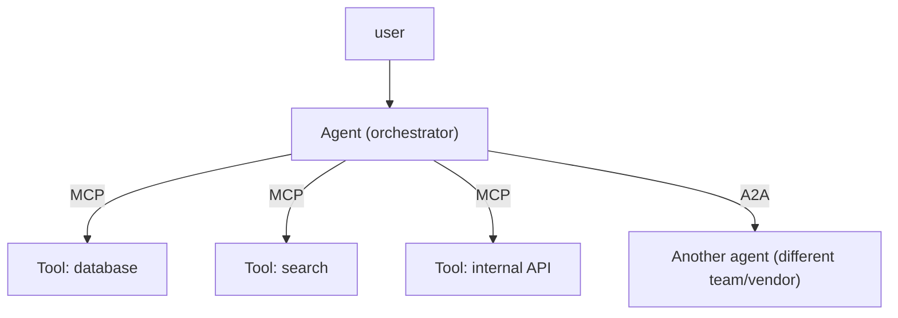

---
tags:
  - lesson
  - apps-agents
  - agents
  - customer-facing
---
# MCP and A2A

## 📝 Context

Two open protocols became the connective tissue of agent systems in 2026: **MCP**
(Model Context Protocol) for giving *one* agent access to tools and data, and **A2A**
(Agent-to-Agent) for coordination *between* agents. This lesson is what each is, when
each applies, and how to explain the "standard plug" idea to a customer worried about
integration sprawl.

> **Recommendation:** use **MCP** to connect an agent to tools/systems (the common
> case). Reach for **A2A** only when you genuinely have multiple independent agents
> that must coordinate — most systems don't.

## 🎯 The Two Protocols

| | MCP | A2A |
| --- | --- | --- |
| **Connects** | One agent → tools & data | Agent ↔ agent |
| **Analogy** | A universal plug for the AI's tools | A shared language between AIs |
| **Origin** | Anthropic; open standard | Google; open standard |
| **You need it when** | The agent must reach your systems | Multiple agents must delegate to each other |
| **Most teams** | Use this | Rarely need this yet |

## 🧭 Where They Sit

MCP is the vertical connection from an agent down to its tools; A2A is the horizontal
connection between agents. Most production value today is in the MCP layer.

  
What an SE says about this

  
"MCP is why 'connect the AI to our systems' stopped being a bespoke integration
  every time. It's a standard interface — build the connector once, any MCP-aware
  agent can use it. That's the integration-sprawl answer customers are looking for."

## 🧩 Worked Scenario: "Will This Lock Us Into One Vendor?"

A customer worries that wiring an agent to their systems means custom glue they'll
rewrite when they switch models or vendors.

- **The concern** — bespoke, model-specific integrations that don't transfer.
- **The MCP answer** — expose each system once as an MCP server; any MCP-aware agent (across vendors) can call it. The integration outlives the model choice.
- **The boundary** — the agent never touches the system directly; it calls the MCP server, which your code controls — a natural place for auth, guardrails, and audit.
- **A2A, if raised** — only relevant if they'll run multiple independent agents that must coordinate; note it exists, don't over-scope.

## 🚨 Failure Path

Reaching for A2A and multi-agent coordination when the real need is one agent calling
a few tools — adding a coordination protocol (and its failure modes) for a problem MCP
alone solves. The mirror-image: building bespoke per-model tool integrations instead
of a reusable MCP server.

- **Symptom** — over-engineered agent-to-agent messaging, or brittle one-off integrations.
- **Root cause** — protocol chosen by novelty, not by whether there are truly multiple agents.
- **Fix** — MCP for tools (almost always); A2A only for real multi-agent coordination.

## 👁️ Audience Lens — Who Hears What

| | Engineer hears | Exec hears | Security hears |
| --- | --- | --- | --- |
| MCP | standard tool interface, one connector | less integration cost, vendor-portable | one controlled, auditable boundary to the agent |
| A2A | inter-agent coordination protocol | only if multiple agents — usually later | more surface to govern; scope carefully |

## 🗣️ Talk Track

  
Say it like this

  
"MCP is a universal plug for connecting the AI to your systems — you expose a
  system once and any AI that speaks the standard can use it, so you're not rebuilding
  integrations every time the model changes. And because the AI reaches your systems
  only through that plug, it's exactly where we put security and audit. Agent-to-agent
  coordination is a separate thing we'd only add if you actually run multiple agents."

## ⚠️ Gotchas

- Conflating MCP and A2A — one connects an agent to tools, the other connects agents to each other.
- Adopting A2A before you have multiple agents — solve the tool problem (MCP) first.
- Treating the MCP boundary as "just plumbing" — it's the right place for auth, guardrails, and audit.
- Assuming MCP makes tools safe by default — your server code still decides what's exposed.

## 🔗 Links

- [Lab 03 · Agent System](/labs/03-agent-system/) — build a real MCP tool the agent calls
- [Agent Architectures](/lessons/apps-agents/agent-architectures) — the systems these protocols connect
- [AI Vocabulary for SAs](/foundations/ai-vocabulary-for-sas) — MCP/A2A in one line each
