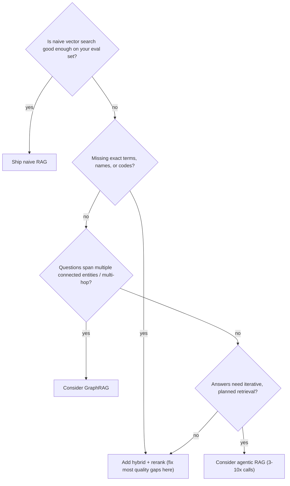

---
tags:
  - lesson
  - apps-agents
  - rag
  - customer-facing
---
# RAG Patterns

## 📝 Context

Most "chat with your docs" projects start naive — embed everything, vector-search,
stuff the top hits into the prompt — and plateau at "kind of works." This lesson is
the ladder of RAG patterns from naive to advanced, and the judgment for *how far up
the ladder a given use case needs to go.* The point isn't to always build the fanciest
pipeline; it's to match the pattern to the problem.

> **Recommendation:** default to **hybrid retrieval + rerank**. Reach for GraphRAG or
> agentic RAG only when the query pattern genuinely demands it — they cost more and
> add failure surface.

## 🎯 The Ladder

| Pattern | What it adds | When it fits |
| --- | --- | --- |
| **Naive RAG** | Vector search → stuff top-k → answer | Prototypes; small, clean, uniform corpora |
| **Hybrid + rerank** | BM25 + dense, RRF fusion, cross-encoder rerank → top-5 | **The production default** |
| **Adaptive / routing** | Match query complexity to pipeline complexity | Mixed query types (lookups vs. analysis) |
| **GraphRAG** | Retrieve over an entity/relationship graph | Multi-hop questions across connected entities |
| **Agentic RAG** | An agent plans multiple retrieval steps | Questions needing iterative, decomposed lookups |

## 🧭 Which Pattern? A Decision Flow

## 📊 Why Hybrid + Rerank Is the Default (illustrative)

Naive vector-only retrieval leaves accuracy on the table; advanced retrieval
(hybrid + rerank) recovers much of it. A commonly cited 2026 comparison puts naive
factual accuracy around **~44%** vs **~63%** with advanced techniques on the same
task — directional, workload-dependent, not a guarantee.

> **Accuracy note:** those figures are *illustrative* and depend entirely on corpus,
> queries, and models. The durable claim is the *ordering*: hybrid + rerank reliably
> beats vector-only, and it's the cheapest big win. Measure on your own eval set.

## 🧩 Worked Scenario: A Support Bot That Misses Product Codes

A vector-only bot answers general questions well but fails whenever a user pastes a
SKU or error code — pure semantic search is weak on literal tokens.

- **Diagnosis** — the failing queries all hinge on exact strings, not meaning.
- **Fix** — add BM25 alongside dense search and fuse with RRF; now exact codes surface.
- **Then** — rerank the fused top-N with a cross-encoder to push the best passages to the top-5.
- **Result** — the code lookups work, and general questions stay just as good. No GraphRAG needed.

## 🚨 Failure Path

Jumping straight to GraphRAG or agentic RAG because they sound impressive — paying
3–10× the cost and adding failure surface for a problem that hybrid + rerank would
have solved. The mirror-image failure is staying naive and blaming the model for
quality that was actually a retrieval problem.

- **Symptom** — an expensive, complex pipeline that isn't measurably better than a simpler one.
- **Root cause** — pattern chosen by novelty, not by the query types in the eval set.
- **Fix** — climb the ladder only when the eval set shows the simpler rung failing.

## 👁️ Audience Lens — Who Hears What

| | Engineer hears | Exec hears | Customer hears |
| --- | --- | --- | --- |
| Hybrid + rerank | BM25 + dense, RRF, cross-encoder | cheap, big quality win | "it finds the right answer more often" |
| GraphRAG / agentic | graph traversal / multi-step planning | more cost and complexity — justify it | (invisible) |

## 🗣️ Talk Track

  
Say it like this

  
"The single biggest quality lever in a system like this is retrieval, not the
  model. We search your documents two ways — by meaning and by exact keywords — and
  double-check the results before the AI reads them. That fixes most 'it gave a wrong
  answer' issues, and it's far cheaper than fancier approaches we'd only add if your
  questions actually needed them."

## ⚠️ Gotchas

- Blaming the model for what's really a retrieval or chunking problem — instrument retrieval first.
- Skipping evaluation — you can't tell if a fancier pattern helped without a test set.
- Reaching for GraphRAG/agentic RAG by default — earn them with query evidence.
- Forgetting that parsing/chunking sets the ceiling (see Context Engineering).

## 🔗 Links

- [Lab 02 · Production RAG](/labs/02-production-rag/) — build hybrid + rerank hands-on
- [Context Engineering](/lessons/apps-agents/context-engineering) — chunking and what goes in the window
- [The Real Cost of a RAG System](/decision-frames/rag-tco) — costing the pattern you choose
- [Explaining a Hallucination](/talk-tracks/explaining-a-hallucination) — when retrieval still misses
