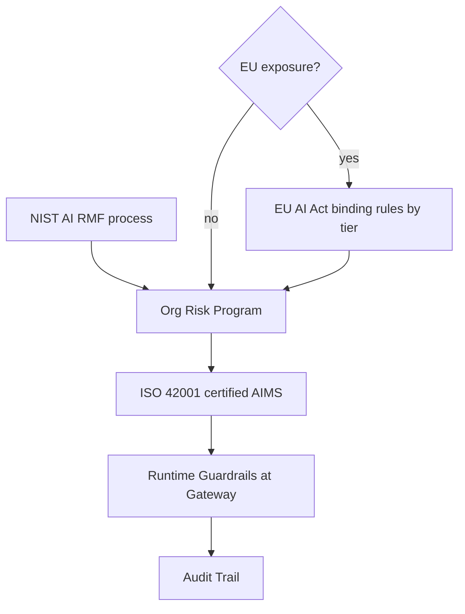

---
tags:
  - lesson
  - architecture-governance
  - customer-facing
---
# Guardrails & Governance

## 📝 Context

Every enterprise AI conversation eventually hits "what about compliance?" — and
that one word can mean three completely different instruments: a voluntary risk
framework, a binding law, and a certifiable standard. Conflating them wastes a
meeting and can leave a real legal obligation unaddressed while a team celebrates
the wrong paperwork. This lesson maps the three, plus the layer none of them
substitute for: the runtime guardrails that actually stop a bad output.

> **Recommendation:** name which instrument a customer means before promising
> anything. **NIST AI RMF** is *how* you think about AI risk (voluntary process).
> **EU AI Act** is *what* you're legally required to do, if it applies to you
> (binding law, tiered by risk). **ISO/IEC 42001** is *proof* you did it
> (certifiable management system). None of the three enforces anything at
> runtime — that's a separate, technical layer.

## 🎯 The Three Instruments (+ the layer that enforces them)

| Instrument | Type | Binding? | Answers |
| --- | --- | --- | --- |
| **NIST AI RMF** | Risk-management framework (Govern / Map / Measure / Manage) | Voluntary | "How do we think about AI risk systematically?" |
| **EU AI Act** | Law | Binding, if you have EU exposure | "What are we legally required to do?" |
| **ISO/IEC 42001** | Certifiable management-system standard (an AI Management System, AIMS) | Voluntary, but auditable — like ISO 27001 for security | "Can we prove our governance to a customer or auditor?" |
| **Runtime guardrails** | Technical enforcement, typically at the gateway | N/A — this is code, not paperwork | "What actually stops a bad output right now?" |

## 🧭 Where Each One Lives

The risk-management process (NIST) and any binding legal requirement (EU AI Act,
if it applies) both feed the organization's risk program. Getting *certified*
(ISO 42001) is how that program becomes provable to someone outside the
organization. None of that matters at 2am unless the **runtime guardrails at the
gateway** — the same governance layer in the
[Enterprise AI Platform](/lessons/architecture-governance/reference-architectures) —
actually enforce it, and log an audit trail proving they did.

  
What an SE says about this

  
"When a customer says 'compliance,' they might mean any of these three, and
  the room usually hasn't agreed which one. Ask before you promise anything —
  a certification project and a legal-obligation project have different scopes,
  different timelines, and different owners."

## 📊 The Facts (verified against official sources, 2026-07)

- **NIST AI RMF** — published January 2023, explicitly "intended for voluntary
  use," organized around four functions (Govern, Map, Measure, Manage). A
  Generative AI Profile was added in 2024.
- **EU AI Act** — a binding regulation, risk-tiered: unacceptable-risk systems
  are banned outright, high-risk systems (e.g. CV-screening tools) carry specific
  legal requirements, limited/minimal-risk systems are largely unregulated.
  Enforcement is phased and still rolling out.
- **ISO/IEC 42001** — a certifiable AI Management System (AIMS) standard,
  positioned like ISO 27001 (information security) or ISO 9001 (quality) —
  organizations can be independently audited and certified against it.

> **Accuracy note:** the EU AI Act's enforcement rolls out in stages across
> 2025–2027 (prohibited-practice bans, general-purpose-AI obligations, and
> high-risk-system requirements land at different times) — verify the current
> phase against an official source before quoting a specific deadline to a
> customer. Don't treat any date here as fixed.

## 🧩 Worked Scenario: "We Need to Be AI Act Compliant"

A customer's compliance team opens a kickoff with exactly that sentence.

- **Unpack the exposure** — do they have EU users, an EU market presence, or an
  EU establishment? The Act's reach isn't limited to companies headquartered in
  the EU; confirm exposure with their legal team rather than guessing.
- **Unpack the risk tier** — "AI Act compliant" is unscoped until you know the
  system's tier. A CV-screening tool is high-risk with real obligations; a
  FAQ-answering support bot is more likely limited-risk with lighter
  transparency requirements. The tier determines the actual work.
- **Separate the certification question** — if what they really want is to
  *show* customers and auditors they take AI governance seriously (regardless of
  EU legal exposure), that's an ISO 42001 conversation, not an AI Act one.
- **The recommendation** — pin down exposure and risk tier before scoping
  anything; don't let "compliance" stay a single undifferentiated line item.

## 🚨 Failure Path

The costly mistake is **collapsing three instruments into one word**: a team
spends months on an ISO 42001 certification believing it satisfies EU AI Act
legal obligations, then discovers the Act's high-risk requirements — conformity
assessment, technical documentation, human oversight — aren't automatically
covered by a voluntary, process-focused certification.

- **Symptom** — "we're compliant" gets repeated in meetings, but nobody can say
  which instrument, or which risk tier, they mean.
- **Root cause** — NIST AI RMF, the EU AI Act, and ISO 42001 are a method, a law,
  and a certification, with different owners and different bindingness —
  treated as interchangeable "compliance work."
- **Fix** — name the instrument, name the risk tier for anything EU-Act-relevant,
  and confirm the runtime guardrails at the gateway actually enforce what the
  paperwork claims.

The mirror-image failure is **governance paperwork with nothing enforcing it** —
a certified AIMS or a tidy risk register with no gateway-level guardrail actually
blocking the behavior the documents describe. That fails a real audit even though
the paperwork reads well.

## 👁️ Audience Lens — Who Hears What

| | Engineer hears | Exec hears | Legal / Compliance hears |
| --- | --- | --- | --- |
| **NIST AI RMF** | a risk-process checklist to build against | no legal obligation, but shows diligence | a defensible process if something goes wrong |
| **EU AI Act** | specific technical requirements by risk tier | real legal exposure, potential fines | the binding obligation to scope and track |
| **ISO 42001** | an auditable management system to maintain | a credential enterprise customers ask for | proof of governance for due diligence |
| **Runtime guardrails** | code that blocks/redacts/logs at the gateway | the thing that actually prevents an incident | the enforcement evidence an audit will ask for |

## 🗣️ Talk Track

  
Say it like this

  
"When you say 'compliance,' I want to make sure we're solving the same
  problem. There's a voluntary framework for how we think about AI risk, a
  binding EU law with specific rules by risk tier, and a certifiable standard you
  can be audited against to prove you take this seriously — three different
  projects, three different owners. Let's name which one you actually need
  first. And separately, we make sure the technical guardrails at your gateway
  actually enforce whatever we agree to — a policy document with no code behind
  it won't survive a real incident."

## ⚠️ Gotchas

- Treating "compliance" as one project — it's a method, a law, and a certification, each with a different owner and different bindingness.
- Assuming ISO 42001 certification satisfies EU AI Act legal obligations — it doesn't automatically; the Act's high-risk requirements are specific and separate.
- Assuming the EU AI Act doesn't apply without EU headquarters — exposure can come from EU market presence or users; confirm with legal, don't guess.
- Governance paperwork with no runtime enforcement — a framework or certification means little if the gateway doesn't actually block what the policy describes.
- Quoting a specific EU AI Act enforcement date without checking the current phase — it rolls out in stages; verify before it goes in a proposal.

## 🔗 Links

- [Reference Architectures](/lessons/architecture-governance/reference-architectures) — where the Governance Layer (gateway + guardrails) sits in the platform tier
- [The Four-Layer Map](/foundations/the-four-layer-map) — L4 is architecture & governance
- [Managed API vs Self-Host](/decision-frames/managed-vs-self-host) — the data-boundary decision that often triggers this conversation
- [What Will This Cost at Scale?](/decision-frames/frame-cost-at-scale) — sizing the platform tier this governance layer sits inside
