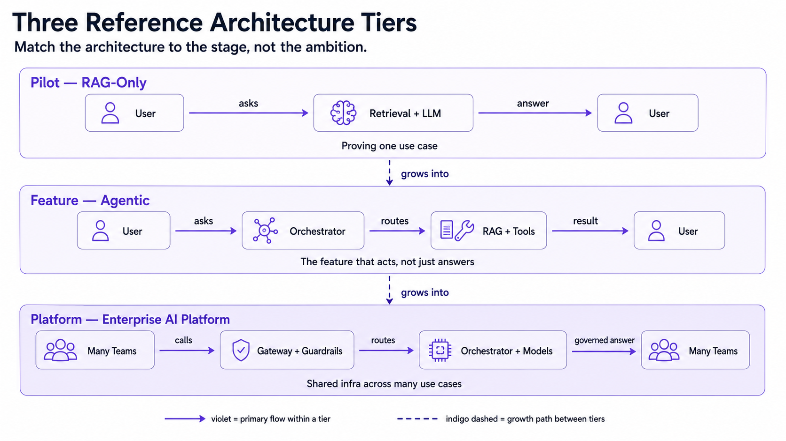
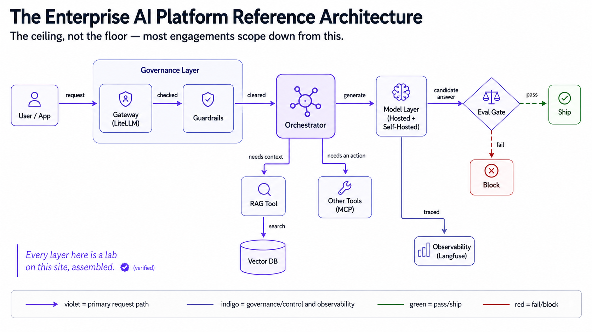

---
tags:
  - lesson
  - architecture-governance
  - customer-facing
---
# Reference Architectures

## 📝 Context

"What will we actually build?" comes up in nearly every kickoff, and the honest
answer is **it depends on your stage** — a pilot, a shipped feature, and a
company-wide AI platform are three different reference architectures, not the same
system with more code bolted on. This lesson gives the three canonical shapes so
you can sketch the right one on a whiteboard instead of a generic blob labeled "AI."

> **Recommendation:** match the reference architecture to the customer's actual
> stage, not their ambition. Start at the tier that answers today's question; add
> layers — a gateway, guardrails, shared observability — only when the stage that
> needs them actually arrives, not because a vendor diagram made them look standard.

## 🎯 The Three Reference Architectures

| Tier | Shape | Answers | Right when |
| --- | --- | --- | --- |
| **Pilot — RAG-only** | Retrieval + generation, no agent, no gateway | "Can we answer questions from our own docs?" | Proving value, one use case, low query volume |
| **Feature — Agentic** | Orchestrator + tools/workers on top of RAG | "Can it also act, not just answer?" | The use case needs multi-step actions, not lookup alone |
| **Platform — Enterprise AI Platform** | Gateway + guardrails + orchestrator + multiple model backends + observability + eval gate | "Can many teams build many features safely?" | Multiple teams/use cases sharing infra, compliance requirements exist |

Each tier is a superset of the one before it — you don't rebuild the RAG pipeline
when you graduate to agentic, and you don't rebuild the orchestrator when you
graduate to platform. You add the layer the new stage actually needs.

## 🧭 The Enterprise AI Platform (the ceiling, not the floor)

This is every layer this site's labs build individually — RAG ([Lab 02](/labs/02-production-rag/)),
an agent + tool ([Lab 03](/labs/03-agent-system/)), an eval gate
([Lab 04](/labs/04-eval-harness/)), serving/cost tradeoffs
([Lab 05](/labs/05-serving-and-cost/)) — assembled into the shape a platform team
actually runs. Almost nobody starts here.

  
What an SE says about this

  
"This is the ceiling, not day one. I'm showing you the full picture so you know
  where the architecture can grow — not because you need to build all of it before
  you ship anything. Most engagements scope down from this to whichever tier matches
  where you actually are."

## 📊 The Resourcing Shape (illustrative)

The step-up between tiers is mostly **people and process, not just code**:

| Tier | Typical build effort | Who owns it |
| --- | --- | --- |
| Pilot (RAG-only) | Weeks | One engineer or a small team |
| Feature (Agentic) | Weeks to a couple months | A product engineering team |
| Platform (Enterprise) | A quarter or more, ongoing | A dedicated platform team |

> **Accuracy note:** these are directional, 2026-era engagement patterns, not a
> costed estimate for any specific customer — real effort depends on team size,
> compliance requirements, and how many existing systems the platform has to
> integrate with.

## 🧩 Worked Scenario: "We Want the Full Platform" on Day One

An exec team asks for a gateway, guardrails, multi-model routing, and observability
before they've shipped a single use case.

- **Unpack the actual ask** — what's the first real use case? Usually "answer
  questions from our handbook" — that's the pilot tier, RAG-only.
- **Reframe** — build the pilot's reference architecture first and prove the use
  case; grow into the platform shape as more teams and use cases actually show up.
  The platform is earned by scale, not requested into existence.
- **Protect the future without building it yet** — keep the pilot's code
  OpenAI-compatible and its calls logged, so growing into the full architecture
  later is an *addition*, not a rewrite. That's the same provider-agnostic pattern
  this site's labs already use.
- **The recommendation** — ship the pilot tier now; revisit the platform
  conversation when a second and third use case are real, not hypothetical.

## 🚨 Failure Path

The costly direction is **building platform-tier infrastructure for a single
pilot** — months spent on a gateway, guardrails, and multi-model routing before the
first real answer ships, while the team that could have proven value in weeks burns
the budget on plumbing nobody else is using yet.

- **Symptom** — a "platform" with exactly one use case and no other team touching
  the shared infrastructure it was built for.
- **Root cause** — the reference architecture was chosen for where the
  organization wants to be, not where it actually is.
- **Fix** — ship the pilot tier, and add the gateway/guardrails/observability layer
  when the second and third use case are real, not before.

The mirror-image failure is **never graduating tiers** — three teams each calling a
model provider directly, no shared guardrails, no visibility when something breaks
in production. That's the moment the platform tier is actually earned; the fix is
building it then, not skipping it forever.

## 👁️ Audience Lens — Who Hears What

| | Engineer hears | Exec hears |
| --- | --- | --- |
| **Pilot (RAG-only)** | ship fast, minimal infra | proof of value, low spend |
| **Feature (Agentic)** | real orchestration work, more moving parts | the feature that acts, not just answers |
| **Platform (Enterprise)** | shared infra, guardrails, on-call | governance and cost control across every team using AI |

## 🗣️ Talk Track

  
Say it like this

  
"You don't need the platform to prove the pilot. We'll build the shape that
  answers your first question — retrieval and generation — and design it so nothing
  gets thrown away when you're ready to add a gateway, guardrails, and shared
  observability for the next five use cases. Buy the platform when you have the use
  cases that need it, not before."

## ⚠️ Gotchas

- Confusing "enterprise-ready" with "needs the full platform on day one" — most organizations have to earn their way there.
- Never graduating tiers — ungoverned, direct-to-provider calls from five teams becomes its own incident eventually.
- Copying a vendor's reference architecture diagram wholesale without checking which tier actually matches the customer's stage.
- Rebuilding the pilot's code when growing tiers — provider-agnostic, logged calls from day one make that an addition, not a rewrite.

## 🔗 Links

- [RAG Patterns](/lessons/apps-agents/rag-patterns) — the pilot tier in depth
- [Agent Architectures](/lessons/apps-agents/agent-architectures) — the agentic tier in depth
- [Managed API vs Self-Host](/decision-frames/managed-vs-self-host) — the model-layer decision inside any tier
- [What Will This Cost at Scale?](/decision-frames/frame-cost-at-scale) — sizing the platform tier's infrastructure
- [Scoping an AI POC](/poc-playbooks/scoping-an-ai-poc) — picking the right tier at kickoff
