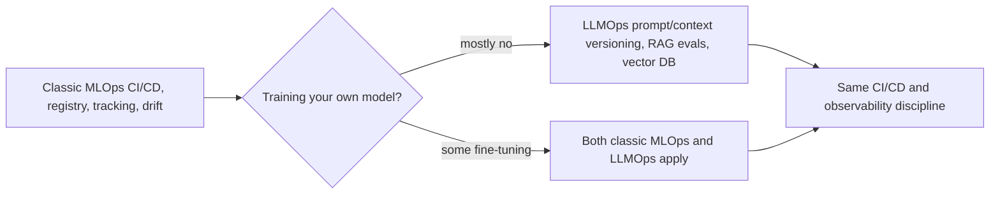

---
tags:
  - lesson
  - mlops-data
  - architecture-governance
  - customer-facing
---
# The MLOps↔LLMOps Bridge

## 📝 Context

A team with a mature classic-ML practice — training pipelines, feature stores, a
model registry, experiment tracking, drift monitoring — often assumes LLM work
needs an entirely separate platform built from scratch. It doesn't.
**LLMOps is an extension of MLOps, not a replacement.** This lesson maps what
carries over unchanged, what needs adapting, and what's genuinely new.

> **Recommendation:** don't rebuild your ops practice for LLMs. Reuse CI/CD, the
> registry, and experiment-tracking discipline as-is; adapt drift detection and
> versioning for prompts and retrieved context instead of just model weights;
> add the genuinely new pieces — a vector database, an LLM-specific eval gate —
> on top of what already exists.

## 🎯 What Carries Over vs What's New

| MLOps practice | Carries over? | What changes for LLMs |
| --- | --- | --- |
| **CI/CD pipelines** | Yes, as-is | Gate on an [eval harness](/labs/04-eval-harness/) (LLM-as-judge) alongside classic metrics |
| **Model registry** | Mostly | Register prompt versions and retrieval configs alongside model weights |
| **Experiment tracking** | Yes, as-is | Track prompt versions and retrieval configs, not just hyperparameters |
| **Feature stores** | Rarely applies | RAG's "features" are retrieved passages from a vector DB, not engineered numeric features |
| **Drift monitoring** | Concept carries over | Watch for prompt/context drift and silent provider model updates, not just input-distribution shift |
| **Training pipelines** | Rarely needed | Most teams call or fine-tune an existing model rather than train one — the biggest structural difference |

## 🧭 The Bridge

  
What an SE says about this

  
"If a customer already runs a mature MLOps practice, that's an asset, not a
  mismatch — most of it reuses directly. The real gap is usually the eval harness
  and drift monitoring, which need to watch prompts and retrieved context instead
  of just model weights."

## 📊 The Shape of the Difference (illustrative)

Most 2026 enterprise AI teams **call or fine-tune an existing model rather than
train one from scratch** — training-pipeline reuse is the exception in an LLMOps
practice, not the rule, which is why it's the one MLOps practice that doesn't
carry over for most teams.

> **Accuracy note:** this is a directional, field-observed pattern, not a
> measured statistic for any specific organization — some teams do fine-tune or
> even pretrain; confirm which situation a given customer is actually in before
> assuming.

## 🧩 Worked Scenario: "This Needs a Whole New Stack"

A platform team with a mature classic-ML MLOps practice is asked to support an
LLM feature and pushes back that it needs entirely new infrastructure.

- **Unpack what already exists** — CI/CD, a registry, experiment tracking,
  monitoring: all of it is reusable as the foundation.
- **Unpack what's actually new** — a vector database for retrieval, an
  LLM-as-judge eval gate, and version tracking for prompts and retrieval configs.
- **The recommendation** — extend the existing platform with these additions
  rather than standing up a parallel stack. One platform team, not two.

## 🚨 Failure Path

The costly mistake is **building a completely separate "LLM platform"** —
duplicating CI/CD, registries, and monitoring that already exist for classic ML,
doubling the maintenance burden and fragmenting on-call for no real technical
reason.

- **Symptom** — two parallel platform teams, two on-call rotations, two
  registries, for what's fundamentally the same discipline plus a few new pieces.
- **Root cause** — treating "LLM" as categorically different from "ML" instead of
  as an extension of it.
- **Fix** — extend the existing MLOps platform: add a vector DB, an LLM eval
  gate, and prompt/context versioning, instead of building a parallel one.

The mirror-image failure is **forcing LLM work through an unmodified classic-ML
pipeline** that has no way to grade language quality or track context changes —
real regressions ship silently because the pipeline only checks what classic ML
checks.

## 👁️ Audience Lens — Who Hears What

| | MLOps engineer hears | Exec hears |
| --- | --- | --- |
| **Extend, don't replace** | reuse CI/CD and the registry; add an eval gate and vector DB | lower cost, one platform team, not two |
| **Build a parallel stack** | a whole new system to learn and maintain | duplicated infrastructure spend, slower to ship |

## 🗣️ Talk Track

  
Say it like this

  
"Your MLOps practice isn't obsolete — it's most of the foundation. We're not
  throwing out your CI/CD, your registry, or your monitoring. We're adding an
  eval harness that grades language quality instead of just accuracy, a vector
  database for retrieval, and version tracking for prompts and context the same
  way you already track model versions. Same team, same platform, a few new
  pieces."

## ⚠️ Gotchas

- Standing up a parallel "LLM platform" instead of extending the existing MLOps one — doubles maintenance for no real gain.
- Assuming feature stores map directly onto RAG — they don't; retrieved passages aren't engineered numeric features.
- Reusing classic drift detection unmodified — it won't catch prompt drift or a silent provider model update changing behavior.
- Assuming every LLM team trains models — most call or fine-tune existing ones; training-pipeline reuse is the exception.

## 🔗 Links

- [Reference Architectures](/lessons/architecture-governance/reference-architectures) — where the model layer sits in the platform tier
- [Lab 04 · Eval Harness](/labs/04-eval-harness/) — the LLM-specific eval gate that extends classic CI/CD
- [Lab 05 · Serving & Cost](/labs/05-serving-and-cost/) — the serving-layer concerns classic MLOps didn't need
- [DevOps Studio](https://wbhankins93.github.io/devops-studio/) — the classic infra/DevOps practice this bridges from, sibling site in the trilogy
