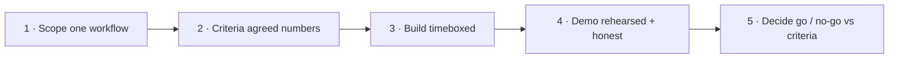

---
tags:
  - poc-playbook
  - apps-agents
  - customer-facing
---
# Scoping an AI POC

## 📝 Context

The single most useful artifact in this repo for your actual job. An AI POC fails in
new ways a traditional software POC doesn't — the model hallucinates in the demo,
"success" was never defined in numbers everyone agreed to, and scope creeps into "can
it also…". This playbook scopes one that survives contact with a real model and a
live room.

> **Recommendation:** pick one narrow workflow, define success as a number everyone
> signs off on *before* you build, timebox it, and rehearse the demo with a recovery
> plan. Most AI POCs fail on the second sentence, not the technology.

## 🧭 The POC Lifecycle

## 🎯 Step 1 · Scope — One Workflow, Ruthlessly Narrow

Pick **one** task with a clear before/after. "AI assistant for the company" is not a
POC; "answer benefits questions from the HR handbook" is. Write down explicitly
what's **out** of scope — that's your defense against the "can it also…" creep that
kills timelines.

The narrower the scope, the more likely the POC succeeds *and* the clearer the signal
it gives. A narrow POC that clearly works beats a broad one that half-works on five
things. Sell the narrowness as a feature: "we prove one thing cleanly, then expand."

## ✅ Step 2 · Success Criteria That Survive a Real Model

This is where AI POCs differ most. Define success as a **measurable bar on a test set
both sides agreed to**, *before* building — not "it feels good in the demo."

- **A shared test set** — ~30–50 real questions with known good answers, supplied by the customer (illustrative size). This is the contract.
- **A measurable bar** — e.g. "correct & grounded on ≥80% of the set," a number both sides sign off on up front.
- **A realistic floor** — not 100%. Agree what "good enough to proceed" means for this use case, given the cost of a wrong answer.
- **An "I don't know" rule** — deferring when unsure counts as success, not failure. Make that explicit in the criteria.

> **Accuracy note:** the "30–50 questions" and "≥80%" figures are *illustrative
> starting points*, not standards — the right test-set size and bar depend on the use
> case and the cost of a wrong answer (a medical lookup and a marketing-copy helper
> are not the same bar). Set them *with* the customer; the point is that a number
> exists and is agreed, not which number it is.

## 🏗️ Step 3 · Build — Timeboxed and Instrumented

Fix the timebox (e.g. 2–3 weeks, illustrative) and build against the test set from
day one, not at the end. Instrument enough to *show* the criteria being met — if
success is "≥80% grounded," you need to display that score, not assert it.

## 🗣️ Step 4 · Demo — Rehearsed and Honest

- **Rehearse** — run the exact demo path twice before the room. Live AI plus no rehearsal is how you get surprised on stage.
- **Lead with the test-set score** — open with the agreed metric met, then show live queries. Anchors the room on criteria, not vibes.
- **Show a hard case on purpose** — demo a question it correctly declines. "Watch it say 'I don't know'" builds more trust than ten easy wins.
- **Don't fish** — avoid improvised off-script queries in the live room; that's where the unrehearsed hallucination lives.

## 🚨 Failure Path — Recovery When It Misbehaves Live

It will, eventually. The recovery *is* the skill. Name it, reframe it as expected,
point at the design that handles it — don't defend or freeze.

  
Say it like this — when it hallucinates on stage

  
"That's a hallucination, and it's exactly what our success criteria measure
  against. In the agreed test set we're grounded on [score]; what you just saw is the
  edge we're designing the guardrails for. Let me show you the same question with
  grounding enforced."

## 🎯 Step 5 · Decide — Go / No-Go Against the Criteria

Because success was defined in numbers up front, the decision is mechanical: did it
clear the agreed bar on the agreed set? That's the whole point of Step 2 — it turns a
subjective "did we like it?" into an objective "did it pass?" and protects both sides
from a demo-day mood call.

## 📋 The One-Page Checklist

- [ ] One workflow scoped; out-of-scope written down.
- [ ] Shared test set agreed (customer-supplied real cases).
- [ ] Measurable success bar agreed **before** building.
- [ ] "I don't know" counts as success, defined.
- [ ] Timebox fixed; built against the test set from day one.
- [ ] Score displayed, not asserted.
- [ ] Demo rehearsed; a hard/declined case included on purpose.
- [ ] Recovery line ready for a live hallucination.
- [ ] Go/no-go decided against the agreed bar, not the room's mood.

## ⚠️ Gotchas

- Scoping broad to look impressive — breadth lowers the success odds and muddies the signal.
- Defining success as "it feels good" — without an agreed number, the demo becomes a mood vote.
- Improvising off-script queries live — that's where the unrehearsed hallucination appears.
- Treating "I don't know" as failure — a model that defers when unsure is working correctly; bake that into the criteria.

## 🔗 Links

- [Explaining a Hallucination](/talk-tracks/explaining-a-hallucination) — the full set of recovery lines
- [Do We Even Need an Agent?](/decision-frames/do-we-need-an-agent) — pre-empt the scope-creep question
- [The Real Cost of a RAG System](/decision-frames/rag-tco) — costing what the POC will become
