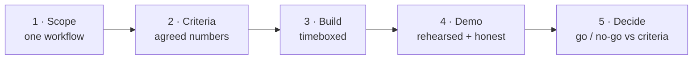

# POC Playbook · Scoping an AI POC

> The single most useful artifact in this repo for your actual job. An AI POC fails
> in new ways a traditional software POC doesn't — the model hallucinates in the
> demo, "success" was never defined in numbers everyone agreed to, and scope creeps
> into "can it also…". This playbook is how you scope one that survives contact with
> a real model and a live room.

::: tip The short version
**Pick one narrow workflow. Define success as a number everyone signs off on
*before* you build. Timebox it. Rehearse the demo and plan the recovery.** Most AI
POCs fail on the second sentence, not the technology.
:::

## The POC lifecycle

## 1 · Scope — one workflow, ruthlessly narrow

Pick **one** task with a clear before/after. "AI assistant for the company" is not
a POC; "answer benefits questions from the HR handbook" is. Write down explicitly
what is **out** of scope — this is your defense against the "can it also…" creep
that kills timelines.

  
What an SE says about this

  
The narrower the scope, the more likely the POC succeeds *and* the clearer the
  signal it gives. A narrow POC that clearly works beats a broad one that
  half-works on five things. Sell the narrowness as a feature: "we prove one thing
  cleanly, then expand."

## 2 · Success criteria that survive a real model

This is where AI POCs differ most. Define success as a **measurable bar on a test
set both sides agreed to**, *before* building — not "it feels good in the demo."

  

A shared test set

~30–50 real questions with known good answers, supplied by the customer (illustrative size). This is the contract.

  

A measurable bar

e.g. "correct & grounded on ≥80% of the set" — a number both sides sign off on up front.

  

A realistic floor

Not 100%. Agree what "good enough to proceed" means for this use case, given the cost of a wrong answer.

  

An "I don't know" rule

Deferring when unsure counts as success, not failure. Make that explicit in the criteria.

::: warning Accuracy note
The "30–50 questions" and "≥80%" figures are **illustrative starting points**, not
standards — the right test-set size and bar depend entirely on the use case and the
cost of a wrong answer (a medical lookup and a marketing-copy helper are not the
same bar). Set them *with* the customer; the point is that a number exists and is
agreed, not which number it is.
:::

## 3 · Build — timeboxed, instrumented

Fix the timebox (e.g. 2–3 weeks, illustrative) and build against the test set from
day one, not at the end. Instrument enough to *show* the criteria being met — if
success is "≥80% grounded," you need to display that score, not assert it.

## 4 · Demo — rehearsed and honest

  

Rehearse

Run the exact demo path twice before the room. Live AI + no rehearsal is how you get surprised on stage.

  

Lead with the test-set score

Open with the agreed metric met, then show live queries. Anchors the room on criteria, not vibes.

  

Show a hard case on purpose

Demo a question it correctly declines. "Watch it say 'I don't know'" builds more trust than ten easy wins.

  

Don't fish

Avoid improvised off-script queries in the live room — that's where the unrehearsed hallucination lives.

## The failure path — recovery when it misbehaves live

It will, eventually. The recovery *is* the skill. Name it, reframe it as expected,
point at the design that handles it — don't defend or freeze.

  
Say it like this — when it hallucinates on stage

  
"That's a hallucination, and it's exactly what our success criteria measure
  against. In the agreed test set we're grounded on [score]; what you just saw is
  the edge we're designing the guardrails for. Let me show you the same question
  with grounding enforced."

  Go deeper
  The full set of recovery lines is the
  <a href="/talk-tracks/explaining-a-hallucination">Explaining a Hallucination</a>
  talk track. Pre-empt the "is this even an agent?" scope question with the
  <a href="/decision-frames/do-we-need-an-agent">Do We Need an Agent?</a> frame, and
  the cost question with <a href="/decision-frames/rag-tco">RAG TCO</a>.

## 5 · Decide — go / no-go against the criteria

Because success was defined in numbers up front, the decision is mechanical: did it
clear the agreed bar on the agreed set? That's the whole point of step 2 — it turns
a subjective "did we like it?" into an objective "did it pass?" and protects both
sides from a demo-day mood call.

## The one-page checklist

- [ ] One workflow scoped; out-of-scope written down.
- [ ] Shared test set agreed (customer-supplied real cases).
- [ ] Measurable success bar agreed **before** building.
- [ ] "I don't know" counts as success, defined.
- [ ] Timebox fixed; built against the test set from day one.
- [ ] Score displayed, not asserted.
- [ ] Demo rehearsed; a hard/declined case included on purpose.
- [ ] Recovery line ready for a live hallucination.
- [ ] Go/no-go decided against the agreed bar, not the room's mood.
