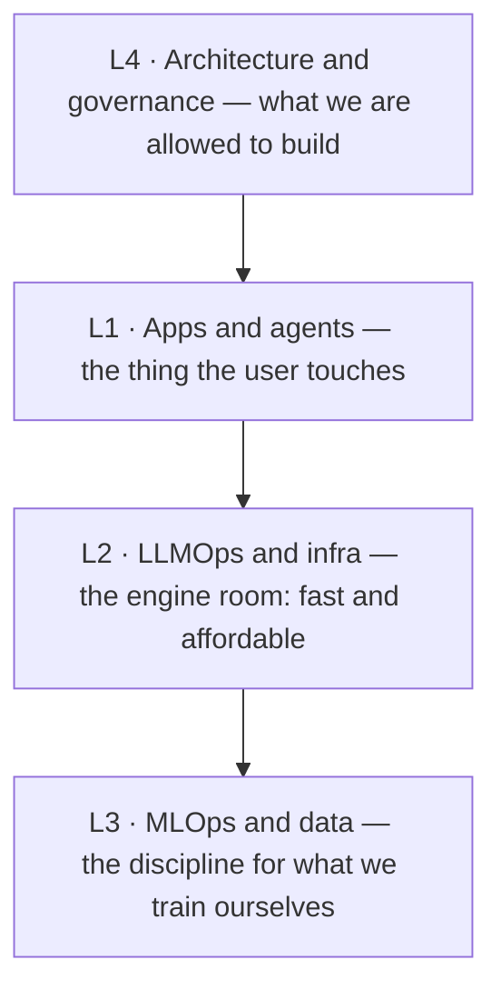

# Visual · The Four-Layer Map

> The whiteboard diagram you actually draw in a kickoff. This is the signature,
> dual-labeled version of the [foundations on-ramp](/foundations/the-four-layer-map)
> — same model, drawn for a room that contains both engineers and executives.

::: tip How to use this page
The [foundations version](/foundations/the-four-layer-map) explains the model.
*This* page is for **drawing it live**: it gives you the diagram dual-labeled
(technical term + plain-English gloss), a "who sees what" lens, and the exact
words to say at each layer. Screenshot it before a kickoff, or redraw it from
memory on their whiteboard — the redraw is the flex.
:::

## The diagram, dual-labeled

::: warning Placeholder diagram
This mermaid is a working stand-in. The signature, dual-labeled version
(engineer term **and** the exec one-liner, in the flat-vector house style) is a
polished image slated to replace it — see `IMAGERY-PLAN.md`, visual
`four-layer-map`. Each layer's engineer-vs-exec phrasing lives in the table below
until then.
:::

Each layer carries two labels: what an **engineer** calls it, and what you say to
an **exec**. Holding both in one frame *is* the translation move.

## Audience lens — one system, three views

The power of the map is that the same architecture looks different to each person
in the room. Make that explicit and nobody feels talked past.

| Layer | Engineer cares about | Exec cares about | Customer cares about |
| --- | --- | --- | --- |
| **L1** apps & agents | retrieval quality, prompt design, eval scores | does it solve the workflow | "does it answer my question correctly" |
| **L2** infra | latency, throughput, GPU cost | cost per query at scale | "is it fast" |
| **L3** MLOps & data | pipelines, drift, reproducibility | do we own our data advantage | (invisible — and that's fine) |
| **L4** governance | guardrails, audit trails | legal/regulatory risk | "is my data safe" |

  
What an SE does with this

  
When the exec and the engineer start talking past each other, point at the
  layer in question and name whose concern is on the table right now. "We're on L2
  — that's the cost question, which is yours, Dana; the retrieval quality John's
  describing is L1. Both matter, let's take them in order." You just made the
  meeting productive.

## Worked scenario — drawing it in a kickoff

A prospect wants an "AI assistant over our policy docs." You draw the four boxes
and walk up the stack:

  

L1 · draw first

"This is a retrieval app — it reads your policies before answering." The visible product.

  

L2 · the cost box

"Here's what decides the running cost — which model, hosted or self-run." Park a number to confirm.

  

L3 · cross it out

"You're not training a model, so we skip this whole layer." Crossing it out builds trust — you're not upselling.

  

L4 · circle it

"This is the one to settle early — where the policy data lives and who can see it."

  
Say it like this

  
"There are four layers to any AI system. The one you're describing lives up
  here — the app. Below it is the infrastructure that decides what it costs to
  run, and wrapping all of it is governance: what's allowed and how we prove it's
  safe. I'm going to cross out the data-science layer entirely, because you're not
  training anything — and that saves you a lot of money and time."

## The failure path this prevents

The number-one SE mistake in a mixed room is **answering at the wrong layer**.
The exec asks an L4 question — "is our data training their model?" — and the
engineer answers with L1 detail — "we use hybrid retrieval with reranking." Both
true; only one is responsive. The exec hears evasion; the deal cools.

  

Symptom

Exec goes quiet or repeats the question. You answered a different layer than they asked.

  

Root cause

Engineer reflex: answer with the most technically interesting detail, not the one asked for.

  

Recovery

"That's an L4 governance question — let me answer that directly, then John can go deeper on the how." Name the layer, then respond to it.

## Source diagram

The mermaid above is the source — copy it into any doc or redraw it freehand. Keep
labels short (it renders in strict mode). Numbers shown in conversation (cost,
latency) are always *illustrative until verified against the customer's actual
volume* — never quote the cost box as authoritative on a first call.

  Go deeper
  Each layer has its own decision frames and labs. The cost box (L2) is worked in
  the <code>decision-frames/rag-tco</code> frame; the governance box (L4) maps to
  the <code>ai-vocabulary-for-sas</code> governance terms and (Phase 4) the
  guardrails lesson.

