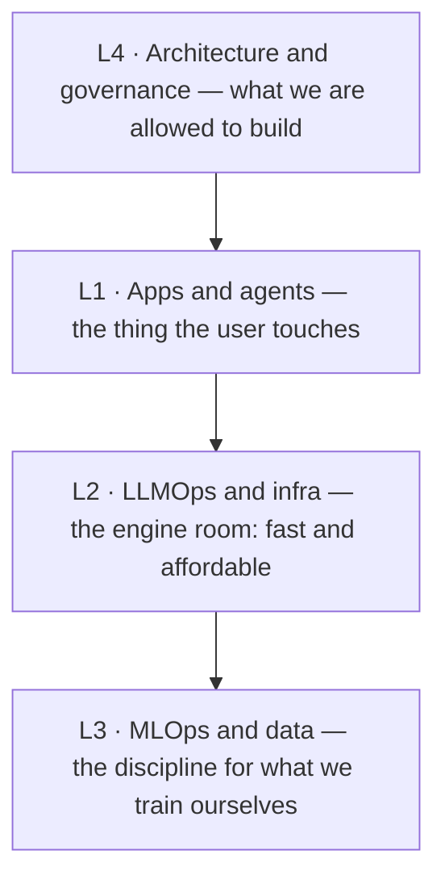

---
tags:
  - visual
  - architecture-governance
  - customer-facing
---
# The Four-Layer Map — Drawing It Live

## 📝 Context

The whiteboard diagram you actually draw in a kickoff — the signature, dual-labeled
version of the [foundations on-ramp](/foundations/the-four-layer-map), drawn for a
room that contains both engineers and executives. The foundations page *explains* the
model; this page is for **drawing it live**: the diagram dual-labeled (technical term
+ plain-English gloss), a "who sees what" lens, and the exact words to say at each
layer. Screenshot it before a kickoff, or redraw it from memory on their whiteboard —
the redraw is the flex.

## 🗺️ The Diagram, Dual-Labeled

> **Placeholder diagram.** This mermaid is a working stand-in. The signature,
> dual-labeled version (engineer term **and** the exec one-liner, in the flat-vector
> house style) is a polished image slated to replace it — see `IMAGERY-PLAN.md`,
> visual `four-layer-map`. Each layer's engineer-vs-exec phrasing lives in the table
> below until then.

Each layer carries two labels: what an **engineer** calls it, and what you say to an
**exec**. Holding both in one frame *is* the translation move.

## 👁️ Audience Lens — One System, Three Views

The same architecture looks different to each person in the room. Make that explicit
and nobody feels talked past.

| Layer | Engineer cares about | Exec cares about | Customer cares about |
| --- | --- | --- | --- |
| **L1** apps & agents | retrieval quality, prompt design, eval scores | does it solve the workflow | "does it answer my question correctly" |
| **L2** infra | latency, throughput, GPU cost | cost per query at scale | "is it fast" |
| **L3** MLOps & data | pipelines, drift, reproducibility | do we own our data advantage | (invisible — and that's fine) |
| **L4** governance | guardrails, audit trails | legal/regulatory risk | "is my data safe" |

When the exec and the engineer start talking past each other, point at the layer in
question and name whose concern is on the table: "We're on L2 — that's the cost
question, which is yours, Dana; the retrieval quality John's describing is L1. Both
matter, let's take them in order." You just made the meeting productive.

## 🧩 Worked Scenario: Drawing It in a Kickoff

A prospect wants an "AI assistant over our policy docs." You draw the four boxes and
walk up the stack:

- **L1 · draw first** — "This is a retrieval app — it reads your policies before answering." The visible product.
- **L2 · the cost box** — "Here's what decides the running cost — which model, hosted or self-run." Park a number to confirm.
- **L3 · cross it out** — "You're not training a model, so we skip this whole layer." Crossing it out builds trust — you're not upselling.
- **L4 · circle it** — "This is the one to settle early — where the policy data lives and who can see it."

  
Say it like this

  
"There are four layers to any AI system. The one you're describing lives up here
  — the app. Below it is the infrastructure that decides what it costs to run, and
  wrapping all of it is governance: what's allowed and how we prove it's safe. I'm
  going to cross out the data-science layer entirely, because you're not training
  anything — and that saves you a lot of money and time."

## 🚨 Failure Path

The number-one SE mistake in a mixed room is **answering at the wrong layer**. The
exec asks an L4 question — "is our data training their model?" — and the engineer
answers with L1 detail — "we use hybrid retrieval with reranking." Both true; only
one is responsive. The exec hears evasion; the deal cools.

- **Symptom** — the exec goes quiet or repeats the question; you answered a different layer than they asked.
- **Root cause** — engineer reflex: answer with the most technically interesting detail, not the one asked for.
- **Recovery** — "That's an L4 governance question — let me answer that directly, then John can go deeper on the how." Name the layer, then respond to it.

## ⚠️ Gotchas

- Quoting the cost box as authoritative on a first call — cost/latency are illustrative until verified against the customer's real volume.
- Skipping the redraw and just sharing a slide — the live redraw is what earns trust; practice it.
- Leaving L4 for later — the data question can reshape the whole architecture; circle it early.

## 🔗 Links

- [The Four-Layer Map (foundations)](/foundations/the-four-layer-map) — the explainer this visual is drawn from
- [The Real Cost of a RAG System](/decision-frames/rag-tco) — the L2 cost box, worked
- [AI Vocabulary for SAs](/foundations/ai-vocabulary-for-sas) — the L4 governance terms
- `IMAGERY-PLAN.md` — the polished image slated to replace the placeholder
